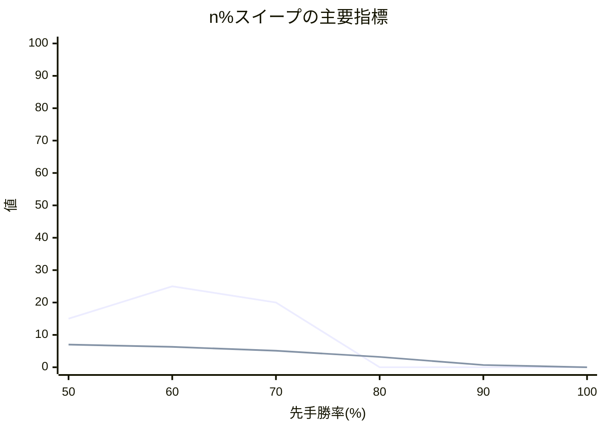

# n% スイープ結果レポート

## 概要
- 評価点数: 6
- 出力CSV: [twill_[先手8x後手8]_50to100_smoke10_quality_sweep.csv](twill_[先手8x後手8]_50to100_smoke10_quality_sweep.csv)

## 注目ポイント
- Spearman 相関が最良の点: **60.00%**（0.947059）
- 平均順位ずれが最良の点: **60.00%**（1.468750）
- Elo1位の総合1位確率が最良の点: **60.00%**（25.000000%）
- 自動おすすめ帯: **60.00% 付近**

## 一覧表
| 先手勝率 | Spearman 相関 | 平均順位ずれ | Elo上位8名残留 | Elo1位の総合1位確率 | 最大不利益 | 最大利益 |
| ---: | ---: | ---: | ---: | ---: | --- | --- |
| 50.00% | 0.932353 | 1.500000 | 7.000000 | 15.000000% | 飛 (+2.800000) | ひよこ (-3.350000) |
| 60.00% | 0.947059 | 1.468750 | 6.300000 | 25.000000% | 角 (+3.200000) | ひよこ (-3.000000) |
| 70.00% | 0.800000 | 2.825000 | 5.100000 | 20.000000% | 飛 (+5.200000) | うさぎ (-4.950000) |
| 80.00% | -0.292862 | 5.525000 | 3.200000 | 0.000000% | 飛 (+9.200000) | ねこ (-6.550000) |
| 90.00% | -0.554820 | 7.575000 | 0.700000 | 0.000000% | 飛 (+9.800000) | ひよこ (-10.150000) |
| 100.00% | -0.867722 | 8.000000 | 0.000000 | 0.000000% | 飛 (+11.500000) | ひよこ (-11.500000) |

## 推移図

## 次回の具体設定案
- 次回の n%スイープ提案
  - 開始する先手勝率(%) = 80.00
  - 終了する先手勝率(%) = 100.00
  - 刻み幅(%) = 10.00
  - ベスト候補(%) = 50.00
  - 近傍候補(%) = 50.00 / 55.00
  - 再探索するなら範囲(%) = 50.00 ～ 60.00
  - 実測ベースの最良値 = Spearman 0.9324, 平均順位ずれ 1.500, Top8残留 7.000
- 理由: 今回の範囲は完走できました。実測で最も良かった 50.00% とその近傍を次の比較候補にできます。選手数 16 人・対局数 64 件なので、狭い範囲で再確認しやすいです。
