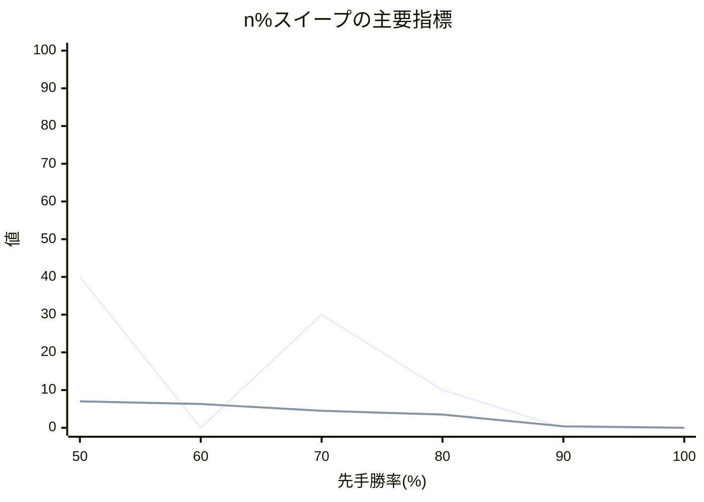

# n% スイープ結果レポート

## 概要
- 評価点数: 6
- 出力CSV: [twill_[先手8x後手8]_50to100_smoke10_quality_sweep.csv](twill_[先手8x後手8]_50to100_smoke10_quality_sweep.csv)

## 注目ポイント
- Spearman 相関が最良の点: **60.00%**（0.897059）
- 平均順位ずれが最良の点: **60.00%**（1.593750）
- Elo1位の総合1位確率が最良の点: **50.00%**（40.000000%）
- 総合点が最良の点: **50.00%**（75896点）
- 自動おすすめ帯: **60.00% 付近**

## 一覧表
| 先手勝率 | 総合点 | 試行回数 | 信頼区分 | Spearman 相関 | 平均順位ずれ | Elo上位8名残留 | Elo1位の総合1位確率 | 最大不利益 | 最大利益 |
| ---: | ---: | ---: | --- | ---: | ---: | ---: | ---: | --- | --- |
| 50.00% | 75896 | 10 | 参考記録 | 0.887417 | 1.656250 | 7.000000 | 40.000000% | きりん (+2.750000) | いのしし (-3.550000) |
| 60.00% | 68730 | 10 | 参考記録 | 0.897059 | 1.593750 | 6.300000 | 0.000000% | 飛 (+3.550000) | いのしし (-4.350000) |
| 70.00% | 45146 | 10 | 参考記録 | 0.438558 | 3.900000 | 4.500000 | 30.000000% | 玉 (+6.200000) | うさぎ (-7.000000) |
| 80.00% | 25662 | 10 | 参考記録 | -0.229412 | 5.425000 | 3.500000 | 10.000000% | 金 (+8.150000) | ひよこ (-8.050000) |
| 90.00% | 10059 | 10 | 参考記録 | -0.547059 | 7.862500 | 0.400000 | 0.000000% | 飛 (+9.750000) | うさぎ (-9.750000) |
| 100.00% | 2646 | 10 | 参考記録 | -0.867722 | 8.000000 | 0.000000 | 0.000000% | 飛 (+11.500000) | ひよこ (-11.500000) |

## 推移図

## 次回の具体設定案
- 次回の n%スイープ提案
  - 開始する先手勝率(%) = 80.00
  - 終了する先手勝率(%) = 100.00
  - 刻み幅(%) = 10.00
  - ベスト候補(%) = 50.00
  - 近傍候補(%) = 50.00 / 55.00
  - 再探索するなら範囲(%) = 50.00 ～ 60.00
  - 実測ベースの最良値 = 総合点 75896, Spearman 0.8874, 平均順位ずれ 1.656, Top8残留 7.000
- 理由: 今回の範囲は完走できました。実測で最も良かった 50.00% とその近傍を次の比較候補にできます。選手数 16 人・対局数 64 件なので、狭い範囲で再確認しやすいです。
