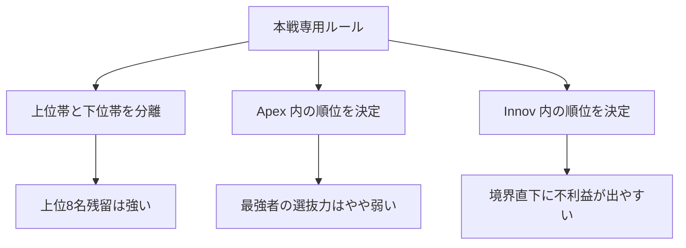

# 【品質評価総括レポート】3ケース比較

## 作成日
2026-05-13

## 目的
本レポートは、ShogiTournamentPairingAnalyzer の品質評価モードで実施した
3 つのケース比較をまとめ、
本戦専用ルールの強み・弱み・今後の改善方向を整理するものである。

## 比較対象
1. `[先手8x後手8]`
2. `トップ集団大きめ`
3. `トップ集団小さめ`

各ケースとも、
- Innov が先手
- Apex が後手
- Apex 内順位を総合 1 位～8 位
- Innov 内順位を総合 9 位～16 位
とする本戦専用ルールで評価した。

## 位置づけの図

## 比較サマリー表
| ケース | Spearman 相関 | 平均順位ずれ | Elo上位8名残留 | Elo1位の総合1位確率 |
| --- | ---: | ---: | ---: | ---: |
| `[先手8x後手8]` | 1.000000 | 1.379225 | 8.000000 | 22.746357% |
| `トップ集団大きめ` | 1.000000 | 1.329722 | 8.000000 | 22.199762% |
| `トップ集団小さめ` | 0.997059 | 1.348922 | 8.000000 | 23.463018% |

## 比較表
1. [先手8x後手8]
- Spearman 相関: 1.000000
- 平均順位ずれ: 1.379225
- Elo上位8名の総合上位8位残留人数: 8.000000
- Elo1位の総合1位確率: 22.746357%
- 最大不利益: 飛 (+2.421000)
- 最大利益: ひよこ (-2.424050)

2. トップ集団大きめ
- Spearman 相関: 1.000000
- 平均順位ずれ: 1.329722
- Elo上位8名の総合上位8位残留人数: 8.000000
- Elo1位の総合1位確率: 22.199762%
- 最大不利益: 圭 (+2.466900)
- 最大利益: 銀 (-2.410250)

3. トップ集団小さめ
- Spearman 相関: 0.997059
- 平均順位ずれ: 1.348922
- Elo上位8名の総合上位8位残留人数: 8.000000
- Elo1位の総合1位確率: 23.463018%
- 最大不利益: いぬ (+2.624450)
- 最大利益: 小ハム (-2.510525)

## まず言えること
3 ケースに共通して、次の点は強い。

1. Elo 上位 8 名は総合上位 8 位に残る
   - 3 ケースとも `averageTop8Retention = 8.0` だった。
   - したがって、この制度は「上位群と下位群の分離」には非常に強い。

2. Elo 順の大枠はかなり保たれる
   - Spearman 相関は 1.0、またはそれに非常に近い値だった。
   - 少なくとも今回の 3 ケースでは、
     実力上位層が制度上の下位帯へ崩れるようなことは起きていない。

3. Elo 1 位の総合 1 位確率はおよそ 22% ～ 23%
   - これはどのケースでも大差がなかった。
   - よって、この制度の性格は個別ケースの偶然ではなく、
     「Apex 内で順位が平均化されやすい」という構造的なものだと考えられる。

## 強み
このルールの強みは、かなりはっきりしている。

- 上位群と下位群を制度上はっきり分けられる
- 先後の偏りを考えた上で、上位群同士を後手側へ寄せられる
- 上位層が制度上の下位帯へ落ちにくい
- ルールの狙いが数値としても再現されている

大会運営上の言い方をすれば、
**「最終順位の上位帯と下位帯を明確に分けたい」という目的には非常に相性が良い**。

## 弱み
一方で、3 ケース比較から弱みもかなり明確になった。

1. Apex に入った後の順位選抜力は強くない
   - Elo 1 位の総合 1 位確率が 22% 台にとどまる。
   - 最強者を鋭く 1 位に押し上げる制度ではない。

2. グループ内順位が平滑化されやすい
   - 平均順位ずれが 1.33 ～ 1.38 程度ある。
   - つまり「順序の大枠」は守るが、「細かい順位」はかなり混ざる。

3. 境界の段差が存在する
   - 特に `トップ集団小さめ` では、Spearman 相関が 1.0 を割った。
   - これは、Apex / Innov 境界付近の参加者に対する制度的段差が、
     順位相関そのものを崩し始めることを意味する。

4. 境界付近の参加者に強い影響が出る
   - `トップ集団大きめ` では Apex 下位の `銀` が大きな利益を受けた。
   - `トップ集団小さめ` では Innov 最上位の `いぬ` が最大不利益になった。
   - つまり、Apex / Innov 境界の上下にいる参加者が最も制度の影響を受けやすい。

## ケース別の見え方
### [先手8x後手8]
- 境界の切り方が素直なケース
- Elo 順と制度境界がきれいに一致している
- 弱点は主に「Apex 内の平滑化」として見える

### トップ集団大きめ
- 上位層が厚いケース
- Apex に入った後の順位平滑化が特に見えやすい
- 境界下ではなく、Apex 下位側に利益が乗る様子が見える

### トップ集団小さめ
- 境界付近の Elo 差が小さいケース
- Spearman 相関が 1.0 を割った
- 制度の弱点が最も露出したケース
- Innov 最上位が強い不利益を受ける

## この3ケースから見える総括
この大会ルールは、
**「最強者を精密に 1 位へ選び抜く制度」ではなく、
「上位帯と下位帯を分離する制度」**
として理解するのが適切である。

言い換えると、
- 強い者を大まかに上位帯へ置く力は強い
- しかし、上位帯の中の厳密な順位付けは弱い
- とくに境界付近には制度的段差が残る
という構造である。

## 境界の段差は無くなるか
結論から言うと、
**Apex / Innov を固定境界で分ける限り、段差は完全には消えにくい**。

理由:
- Apex に入れば総合上位帯が保証される
- Innov に入れば総合下位帯へ固定される
- この構造自体が段差を作る

したがって、段差を「無くす」には、
境界そのものを柔らかくする必要がある。

## 改善案の方向性
1. 境界救済戦を入れる
   - Apex 下位と Innov 上位に追加判定戦を設ける
   - たとえば Apex 8 位相当と Innov 1 位相当に入替判定を入れる

2. 境界可変枠を入れる
   - 8 / 8 を固定せず、境界付近の実力差が小さい場合は可変にする
   - 例: 7 / 9, 9 / 7 を許す

3. Apex 内順位の決め方を強化する
   - 勝数だけではなく、相手強度や補助指標を使う
   - あるいはプレーオフを追加する

4. Innov 上位への部分救済を入れる
   - Innov 1 位だけは総合 8 位相当と比較対象にするなど、
     固定的な 9 位開始を少し緩める

5. 比較対象を増やす
   - 通常総当たり戦
   - 本戦不出場Apexありケース
   - 境界付近同格ケース
   と比較し、改善案が本当に効くかを見る

## いま言えそうなこと
このルールを説明するときは、次のように言うのがよさそうである。

- 上位帯と下位帯の分離には強い
- 先後補正を意識した制度として、大枠の実力順はよく保つ
- ただし、境界付近には制度的段差が残る
- 今後の改善課題は、境界の段差をどう柔らかくするかにある

## 次にやるとよいこと
1. 本戦不出場Apexありケースを試す
2. 境界救済ルールの仮案を 1 つ実装して比較する
3. 通常総当たり戦を比較対象に追加する
4. 3 ケース比較を表形式で README か別資料へ再整理する

以上。
