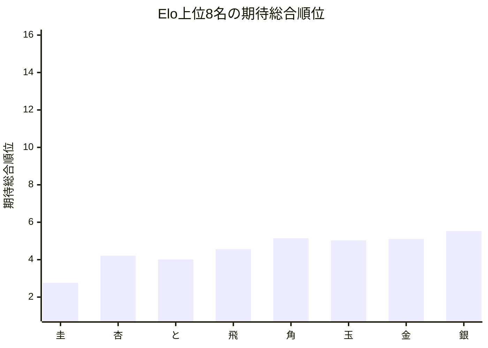
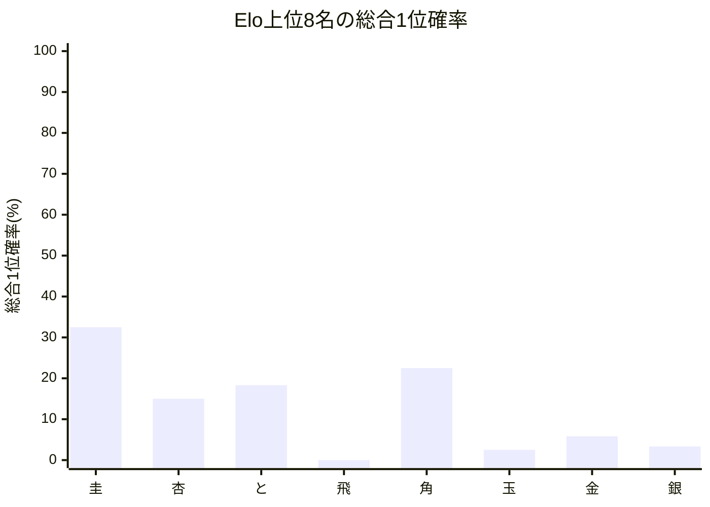

# 品質評価サマリーレポート

## 概要
- 計算モード: 本戦専用 シミュレーション (10回)
- 対象選手数: 16
- サマリーCSV: [[トップ集団大きめ]_[FinalStage_Single10_STSAInput4_smoke]_quality_summary.csv]([トップ集団大きめ]_[FinalStage_Single10_STSAInput4_smoke]_quality_summary.csv)
- 選手別CSV: [[トップ集団大きめ]_[FinalStage_Single10_STSAInput4_smoke]_quality_players.csv](../Players/[トップ集団大きめ]_[FinalStage_Single10_STSAInput4_smoke]_quality_players.csv)

## 指標サマリー
| 指標 | 値 | 意味 |
| --- | ---: | --- |
| Spearman 相関 | 0.982353 | Elo順位と期待総合順位の相関 |
| 平均順位ずれ | 1.419364 | 期待総合順位とElo順位のずれの絶対値平均 |
| Elo上位8名の総合上位8位残留人数 | 7.651744 | Elo上位8名が総合上位8位に残る人数の期待値 |
| Elo1位の総合1位確率 | 32.500000% | Elo1位が総合1位になる確率 |

## 着目選手
- 最大不利益: **杏** (+2.208706)
- 最大利益: **ねこ** (-3.700000)
- 総合1位確率が最も高い選手: **圭**（32.50%）

## 自動コメント
- 実力順の並び: 少し崩れ始めています。
- 平均順位の安定感: 比較的おだやかです。
- 上位8名の残留: かなり保たれています。
- 最強者の押し上げ: かなり強いです。

### 不利益が大きい選手
| 選手 | Elo順位 | 期待総合順位 | ずれ | 総合1位確率 | 総合上位8位確率 |
| --- | ---: | ---: | ---: | ---: | ---: |
| | 杏 | 2 | 4.209 | +2.208706 | 15.00% | 94.13% | 
| | 圭 | 1 | 2.763 | +1.763485 | 32.50% | 98.65% | 
| | 香 | 10 | 12.282 | +1.281765 | 0.00% | 11.82% | 

### 利益が大きい選手
| 選手 | Elo順位 | 期待総合順位 | ずれ | 総合1位確率 | 総合上位8位確率 |
| --- | ---: | ---: | ---: | ---: | ---: |
| | ねこ | 16 | 13.300 | -3.700000 | 0.00% | 0.00% | 
| | 銀 | 8 | 5.523 | -2.476843 | 3.33% | 92.68% | 
| | いぬ | 15 | 13.750 | -2.250000 | 0.00% | 0.00% | 

## Mermaid 図

## 次回の具体設定案
- 次回の品質評価提案
  - 同Elo対局時の先手勝率(%) = 51.00
  - ピンポイント比較候補(%) = 52.00
  - シミュレーション試行回数 = 1,000
  - 軽量確認の見方 = 選手 16 人 / 対局 64 件では、先に 1 条件だけ再確認してから横比較
- 理由: 今回の条件で回せました。選手数 16 人・対局数 64 件なので、現条件とピンポイント候補を並べて比較できます。
