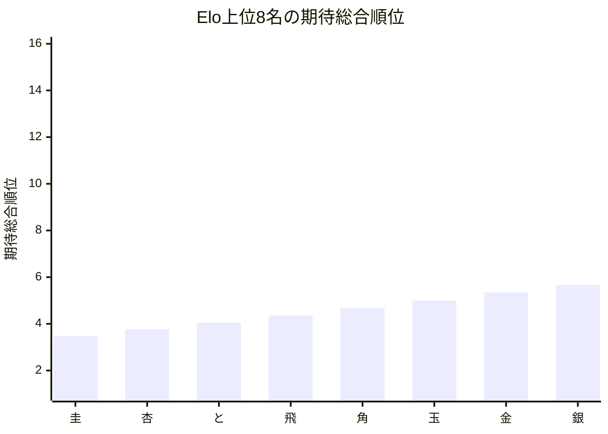
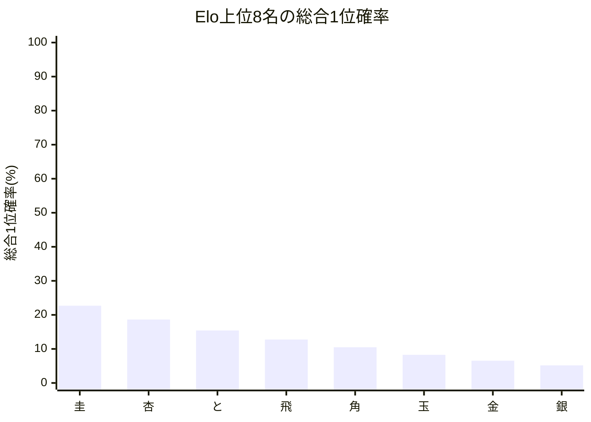

# 品質評価サマリーレポート

## 概要
- 計算モード: 本戦専用 シミュレーション (20,000回)
- 対象選手数: 16
- サマリーCSV: [[トップ集団大きめ]_quality_summary.csv]([トップ集団大きめ]_quality_summary.csv)
- 選手別CSV: [[トップ集団大きめ]_quality_players.csv](../Players/[トップ集団大きめ]_quality_players.csv)

## 総合点
- 総合点: 78744 / 100000
- 試行回数: 20000
- 信頼区分: 本評価
- スコアルール: Balanced
- 平均順位ずれ許容値: 4.0

| 内訳 | 正規化値 | 点 | 最大点 |
| --- | ---: | ---: | ---: |
| Spearman 相関 | 1.000000 | 40000 | 40000 |
| 平均順位ずれ | 0.648954 | 16224 | 25000 |
| Elo上位8名残留 | 0.955793 | 19116 | 20000 |
| Elo1位の総合1位確率 | 0.226951 | 3404 | 15000 |

## 指標サマリー
| 指標 | 値 | 意味 |
| --- | ---: | --- |
| Spearman 相関 | 1.000000 | Elo順位と期待総合順位の相関 |
| 平均順位ずれ | 1.404183 | 期待総合順位とElo順位のずれの絶対値平均 |
| Elo上位8名の総合上位8位残留人数 | 7.646343 | Elo上位8名が総合上位8位に残る人数の期待値 |
| Elo1位の総合1位確率 | 22.695077% | Elo1位が総合1位になる確率 |

## 着目選手
- 最大不利益: **圭** (+2.469875)
- 最大利益: **ねこ** (-3.380480)
- 総合1位確率が最も高い選手: **圭**（22.70%）

## 自動コメント
- 実力順の並び: かなり強く保たれています。
- 平均順位の安定感: 比較的おだやかです。
- 上位8名の残留: かなり保たれています。
- 最強者の押し上げ: そこそこ確保されています。

### 不利益が大きい選手
| 選手 | Elo順位 | 期待総合順位 | ずれ | 総合1位確率 | 総合上位8位確率 |
| --- | ---: | ---: | ---: | ---: | ---: |
| 圭 | 1 | 3.470 | +2.469875 | 22.70% | 98.94% |
| 杏 | 2 | 3.775 | +1.775115 | 18.63% | 98.48% |
| 桂 | 9 | 11.129 | +1.128700 | 0.00% | 11.15% |

### 利益が大きい選手
| 選手 | Elo順位 | 期待総合順位 | ずれ | 総合1位確率 | 総合上位8位確率 |
| --- | ---: | ---: | ---: | ---: | ---: |
| ねこ | 16 | 13.620 | -3.380480 | 0.00% | 0.85% |
| いぬ | 15 | 13.343 | -2.656774 | 0.00% | 1.21% |
| 銀 | 8 | 5.666 | -2.333615 | 5.18% | 89.83% |

## Mermaid 図

## 次回の具体設定案
- 次回の品質評価提案
  - 同Elo対局時の先手勝率(%) = 51.00
  - ピンポイント比較候補(%) = 52.00
  - シミュレーション試行回数 = 10,000
  - まず一点だけ見る試行回数 = 5,000
  - 軽量確認の見方 = 選手 16 人 / 対局 64 件では、先に 1 条件だけ再確認してから横比較
- 理由: 今回の条件で回せました。選手数 16 人・対局数 64 件なので、現条件とピンポイント候補を並べて比較できます。
