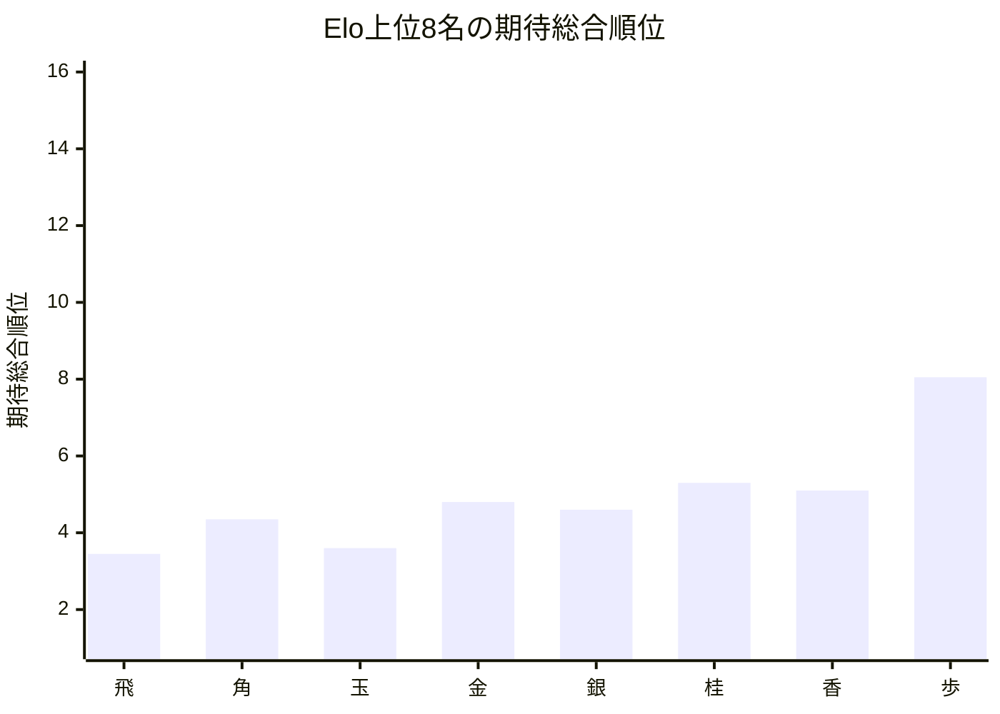
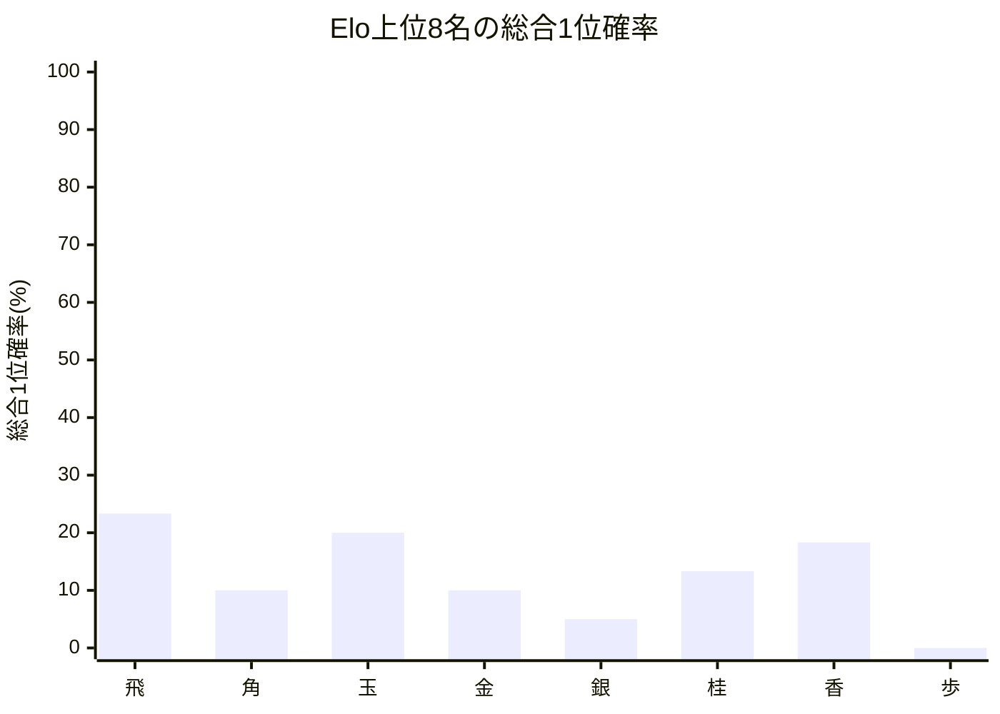

# 品質評価サマリーレポート

## 概要
- 計算モード: シミュレーション (10回)
- 対象選手数: 16
- サマリーCSV: [[先手8x後手8]_[Neutral_Single10_STSAInput2_draft]_quality_summary.csv]([先手8x後手8]_[Neutral_Single10_STSAInput2_draft]_quality_summary.csv)
- 選手別CSV: [[先手8x後手8]_[Neutral_Single10_STSAInput2_draft]_quality_players.csv](../Players/[先手8x後手8]_[Neutral_Single10_STSAInput2_draft]_quality_players.csv)

## 総合点
- 総合点: 76240 / 100000
- 試行回数: 10
- 信頼区分: 参考記録
- スコアルール: Balanced
- 平均順位ずれ許容値: 4.0

| 内訳 | 正規化値 | 点 | 最大点 |
| --- | ---: | ---: | ---: |
| Spearman 相関 | 0.961765 | 38471 | 40000 |
| 平均順位ずれ | 0.664062 | 16602 | 25000 |
| Elo上位8名残留 | 0.883333 | 17667 | 20000 |
| Elo1位の総合1位確率 | 0.233333 | 3500 | 15000 |

## 指標サマリー
| 指標 | 値 | 意味 |
| --- | ---: | --- |
| Spearman 相関 | 0.923529 | Elo順位と期待総合順位の相関 |
| 平均順位ずれ | 1.343750 | 期待総合順位とElo順位のずれの絶対値平均 |
| Elo上位8名の総合上位8位残留人数 | 7.066667 | Elo上位8名が総合上位8位に残る人数の期待値 |
| Elo1位の総合1位確率 | 23.333333% | Elo1位が総合1位になる確率 |

## 着目選手
- 最大不利益: **飛** (+2.450000)
- 最大利益: **いのしし** (-3.750000)
- 総合1位確率が最も高い選手: **飛**（23.33%）

## 自動コメント
- 実力順の並び: はっきり崩れています。
- 平均順位の安定感: 比較的おだやかです。
- 上位8名の残留: 少し崩れています。
- 最強者の押し上げ: そこそこ確保されています。

### 不利益が大きい選手
| 選手 | Elo順位 | 期待総合順位 | ずれ | 総合1位確率 | 総合上位8位確率 |
| --- | ---: | ---: | ---: | ---: | ---: |
| 飛 | 1 | 3.450 | +2.450000 | 23.33% | 100.00% |
| ぞう | 10 | 12.350 | +2.350000 | 0.00% | 6.67% |
| 角 | 2 | 4.350 | +2.350000 | 10.00% | 100.00% |

### 利益が大きい選手
| 選手 | Elo順位 | 期待総合順位 | ずれ | 総合1位確率 | 総合上位8位確率 |
| --- | ---: | ---: | ---: | ---: | ---: |
| いのしし | 15 | 11.250 | -3.750000 | 0.00% | 25.00% |
| 香 | 7 | 5.100 | -1.900000 | 18.33% | 86.67% |
| うさぎ | 14 | 12.150 | -1.850000 | 0.00% | 10.00% |

## Mermaid 図

## 次回の具体設定案
- 次回の品質評価提案
  - 同Elo対局時の先手勝率(%) = 51.00
  - ピンポイント比較候補(%) = 52.00
  - シミュレーション試行回数 = 1,000
  - 軽量確認の見方 = 選手 16 人 / 対局 64 件では、先に 1 条件だけ再確認してから横比較
- 理由: 今回の条件で回せました。選手数 16 人・対局数 64 件なので、現条件とピンポイント候補を並べて比較できます。
