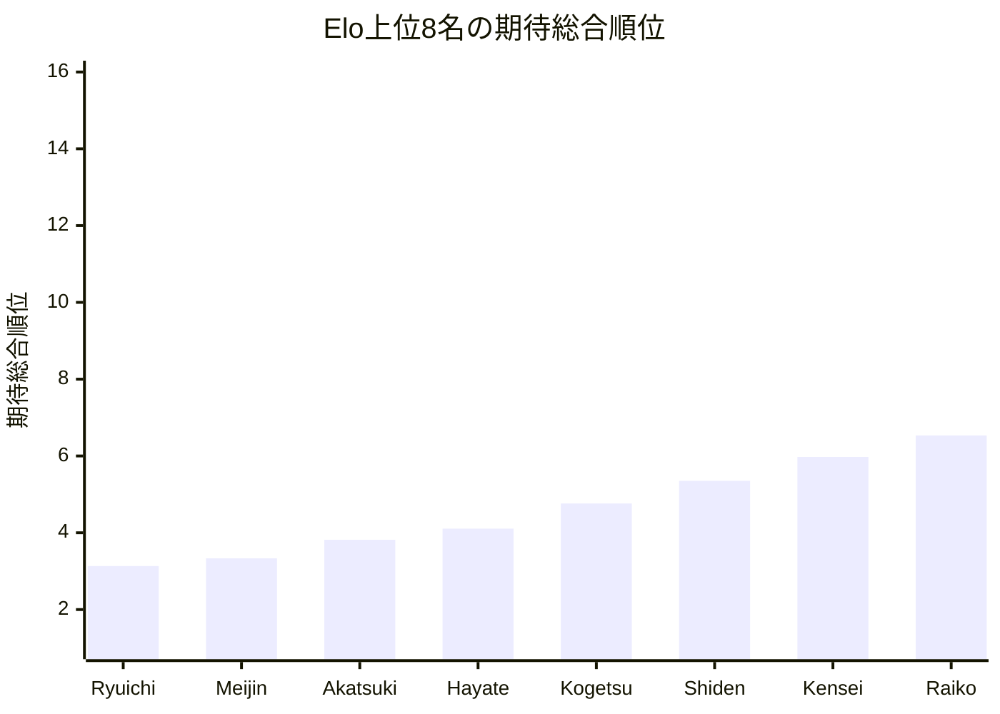
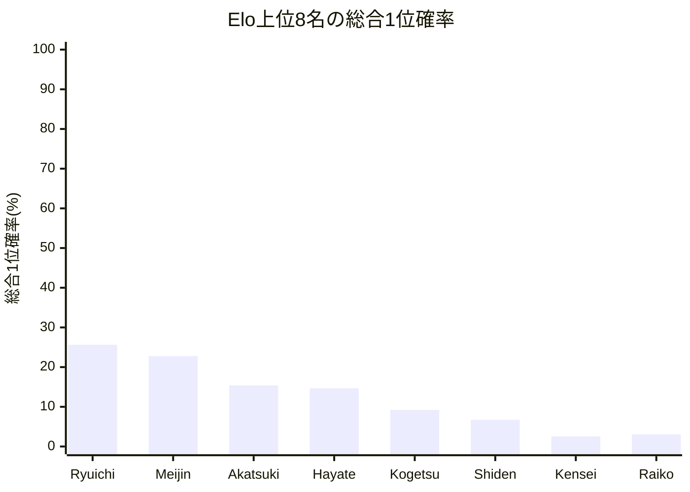

# 品質評価サマリーレポート

## 概要
- 計算モード: シミュレーション (200回)
- 対象選手数: 16
- サマリーCSV: [trial_cup_2026_quality_neutral_single200_summary.csv](trial_cup_2026_quality_neutral_single200_summary.csv)
- 選手別CSV: [quality_players_20260610_001548.csv](quality_players_20260610_001548.csv)

## 総合点
- 総合点: 81730 / 100000
- 試行回数: 200
- 信頼区分: 軽量確認
- スコアルール: Balanced
- 平均順位ずれ許容値: 4.0

| 内訳 | 正規化値 | 点 | 最大点 |
| --- | ---: | ---: | ---: |
| Spearman 相関 | 1.000000 | 40000 | 40000 |
| 平均順位ずれ | 0.756406 | 18910 | 25000 |
| Elo上位8名残留 | 0.948763 | 18975 | 20000 |
| Elo1位の総合1位確率 | 0.256333 | 3845 | 15000 |

## 指標サマリー
| 指標 | 値 | 意味 |
| --- | ---: | --- |
| Spearman 相関 | 1.000000 | Elo順位と期待総合順位の相関 |
| 平均順位ずれ | 0.974375 | 期待総合順位とElo順位のずれの絶対値平均 |
| Elo上位8名の総合上位8位残留人数 | 7.590107 | Elo上位8名が総合上位8位に残る人数の期待値 |
| Elo1位の総合1位確率 | 25.633333% | Elo1位が総合1位になる確率 |

## 着目選手
- 最大不利益: **Ryuichi** (+2.132500)
- 最大利益: **Nozomi** (-2.190000)
- 総合1位確率が最も高い選手: **Ryuichi**（25.63%）

## 自動コメント
- 実力順の並び: かなり強く保たれています。
- 平均順位の安定感: かなり小さめです。
- 上位8名の残留: かなり保たれています。
- 最強者の押し上げ: そこそこ確保されています。

### 不利益が大きい選手
| 選手 | Elo順位 | 期待総合順位 | ずれ | 総合1位確率 | 総合上位8位確率 |
| --- | ---: | ---: | ---: | ---: | ---: |
| Ryuichi | 1 | 3.132 | +2.132500 | 25.63% | 99.83% |
| Mizuki | 9 | 10.650 | +1.650000 | 0.00% | 11.05% |
| Meijin | 2 | 3.333 | +1.332500 | 22.78% | 99.21% |

### 利益が大きい選手
| 選手 | Elo順位 | 期待総合順位 | ずれ | 総合1位確率 | 総合上位8位確率 |
| --- | ---: | ---: | ---: | ---: | ---: |
| Nozomi | 16 | 13.810 | -2.190000 | 0.00% | 0.37% |
| Raiko | 8 | 6.535 | -1.465000 | 3.06% | 84.18% |
| Yukari | 15 | 13.795 | -1.205000 | 0.00% | 0.38% |

## Mermaid 図

## 次回の具体設定案
- 次回の品質評価提案
  - 同Elo対局時の先手勝率(%) = 52.00
  - ピンポイント比較候補(%) = 53.00
  - シミュレーション試行回数 = 1,000
  - 軽量確認の見方 = 選手 16 人 / 対局 56 件では、先に 1 条件だけ再確認してから横比較
- 理由: 今回の条件で回せました。選手数 16 人・対局数 56 件なので、現条件とピンポイント候補を並べて比較できます。
