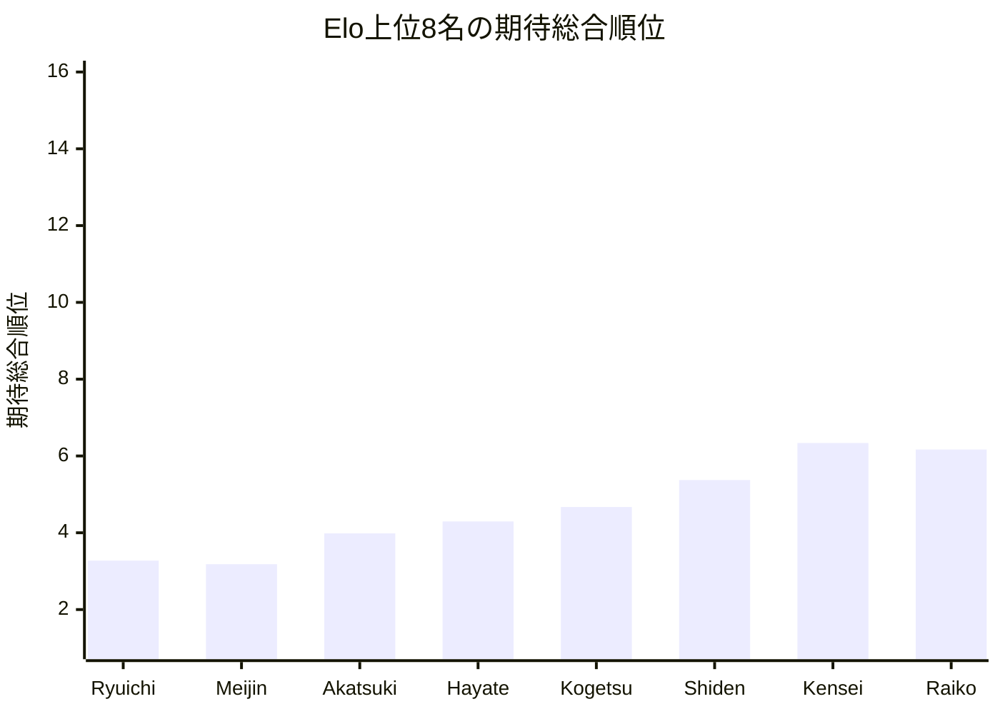
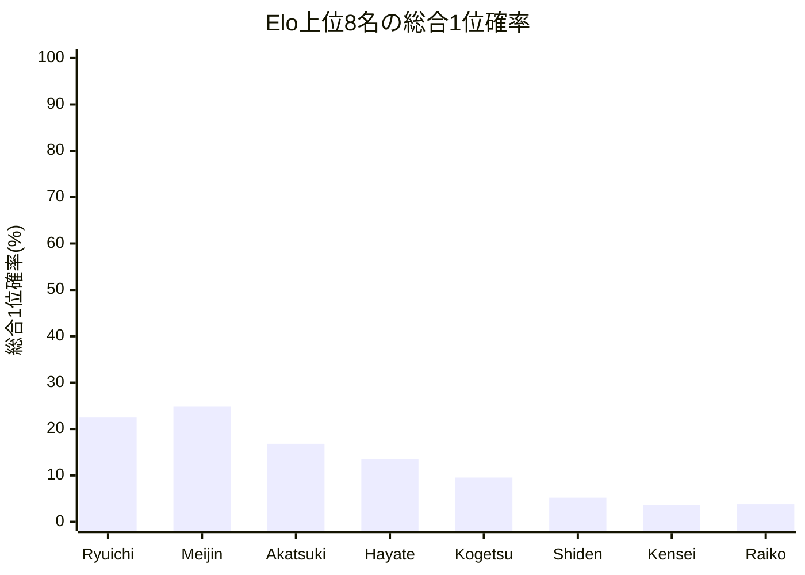

# 品質評価サマリーレポート

## 概要
- 計算モード: シミュレーション (200回)
- 対象選手数: 16
- サマリーCSV: [trial_cup_2026_quality_neutral_single200_summary.csv](trial_cup_2026_quality_neutral_single200_summary.csv)
- 選手別CSV: [quality_players_20260609_222556.csv](quality_players_20260609_222556.csv)

## 指標サマリー
| 指標 | 値 | 意味 |
| --- | ---: | --- |
| Spearman 相関 | 0.994118 | Elo順位と期待総合順位の相関 |
| 平均順位ずれ | 1.000000 | 期待総合順位とElo順位のずれの絶対値平均 |
| Elo上位8名の総合上位8位残留人数 | 7.520881 | Elo上位8名が総合上位8位に残る人数の期待値 |
| Elo1位の総合1位確率 | 22.475000% | Elo1位が総合1位になる確率 |

## 着目選手
- 最大不利益: **Ryuichi** (+2.275000)
- 最大利益: **Nozomi** (-2.010000)
- 総合1位確率が最も高い選手: **Meijin**（24.92%）

## 自動コメント
- 実力順の並び: 概ね保たれています。
- 平均順位の安定感: かなり小さめです。
- 上位8名の残留: かなり保たれています。
- 最強者の押し上げ: そこそこ確保されています。

### 不利益が大きい選手
| 選手 | Elo順位 | 期待総合順位 | ずれ | 総合1位確率 | 総合上位8位確率 |
| --- | ---: | ---: | ---: | ---: | ---: |
| | Ryuichi | 1 | 3.275 | +2.275000 | 22.48% | 99.51% | 
| | Mizuki | 9 | 10.385 | +1.385000 | 0.10% | 19.73% | 
| | Meijin | 2 | 3.182 | +1.182500 | 24.92% | 99.50% | 

### 利益が大きい選手
| 選手 | Elo順位 | 期待総合順位 | ずれ | 総合1位確率 | 総合上位8位確率 |
| --- | ---: | ---: | ---: | ---: | ---: |
| | Nozomi | 16 | 13.990 | -2.010000 | 0.00% | 0.67% | 
| | Raiko | 8 | 6.168 | -1.832500 | 3.77% | 87.11% | 
| | Yukari | 15 | 13.562 | -1.437500 | 0.00% | 1.00% | 

## Mermaid 図

## 次回の具体設定案
- 次回の品質評価提案
  - 同Elo対局時の先手勝率(%) = 52.00
  - ピンポイント比較候補(%) = 53.00
  - シミュレーション試行回数 = 1,000
  - 軽量確認の見方 = 選手 16 人 / 対局 56 件では、先に 1 条件だけ再確認してから横比較
- 理由: 今回の条件で回せました。選手数 16 人・対局数 56 件なので、現条件とピンポイント候補を並べて比較できます。
