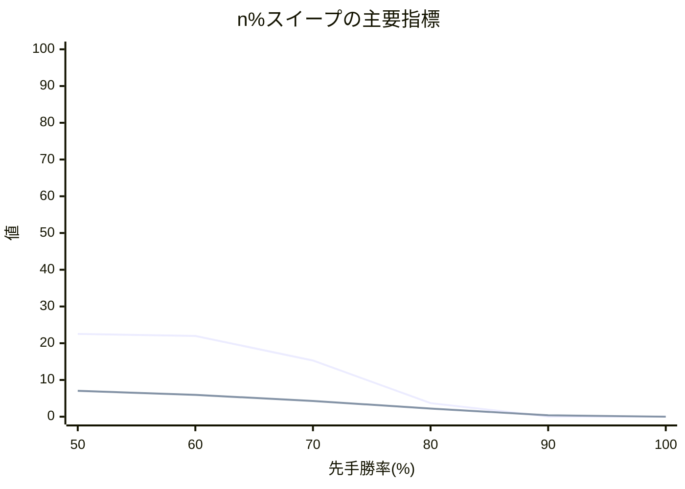

# n% スイープ結果レポート

## 概要
- 評価点数: 6
- 出力CSV: [neutral_[先手8x後手8]_50to100_quality_sweep.csv](neutral_[先手8x後手8]_50to100_quality_sweep.csv)

## 注目ポイント
- Spearman 相関が最良の点: **50.00%**（1.000000）
- 平均順位ずれが最良の点: **50.00%**（1.231458）
- Elo1位の総合1位確率が最良の点: **50.00%**（22.529463%）
- 自動おすすめ帯: **50.00% 付近**

## 一覧表
| 先手勝率 | Spearman 相関 | 平均順位ずれ | Elo上位8名残留 | Elo1位の総合1位確率 | 最大不利益 | 最大利益 |
| ---: | ---: | ---: | ---: | ---: | --- | --- |
| 50.00% | 1.000000 | 1.231458 | 7.043164 | 22.529463% | 飛 (+2.658268) | ひよこ (-2.650268) |
| 60.00% | 1.000000 | 1.511997 | 5.943363 | 21.982046% | 飛 (+3.210015) | ひよこ (-3.202382) |
| 70.00% | 0.732353 | 3.598590 | 4.294954 | 15.303329% | 飛 (+4.809095) | ひよこ (-4.821972) |
| 80.00% | -0.505882 | 6.302902 | 2.222887 | 3.699407% | 飛 (+7.748425) | ひよこ (-7.745950) |
| 90.00% | -0.505882 | 7.875565 | 0.381370 | 0.048751% | 飛 (+10.226773) | ひよこ (-10.229965) |
| 100.00% | -0.867722 | 8.000000 | 0.000000 | 0.000000% | 飛 (+11.500000) | ひよこ (-11.500000) |

## 推移図

## 次回の具体設定案
- 次回の n%スイープ提案
  - 開始する先手勝率(%) = 53.00
  - 終了する先手勝率(%) = 83.00
  - 刻み幅(%) = 15.00
  - ベスト候補(%) = 50.00
  - 近傍候補(%) = 50.00 / 57.50
  - 再探索するなら範囲(%) = 50.00 ～ 65.00
  - 実測ベースの最良値 = Spearman 1.0000, 平均順位ずれ 1.231, Top8残留 7.043
  - 軽量確認の目安 = 選手 16 人 / 対局 64 件なので、まず 1 点または 3 点だけ確認
- 理由: 今回の範囲は完走できました。実測で最も良かった 50.00% とその近傍を次の比較候補にできます。選手数 16 人・対局数 64 件なので、狭い範囲で再確認しやすいです。
