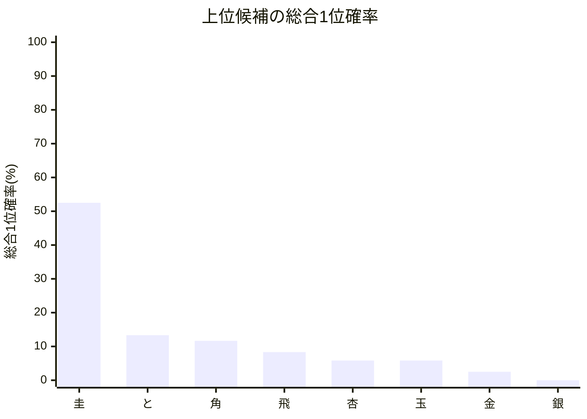
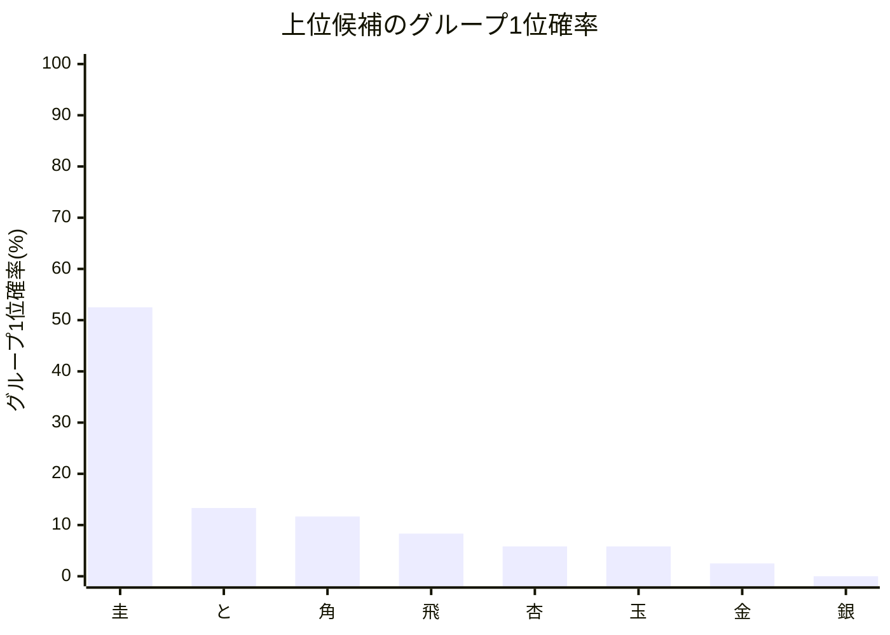

# 最終順位結果レポート

## 概要
- 結果CSV: [final_stage_compare_final_ranking_[確認用].csv](final_stage_compare_final_ranking_[確認用].csv)
- 版: 本戦版
- 計算モード: 本戦専用 シミュレーション (10回)
- 同Elo対局時の先手勝率: 51.00%
- 対象選手数: 16

## 注目ポイント
- 総合1位確率が最も高い選手: **圭**（52.50%）
- Apex で最も有力な選手: **圭**（グループ1位確率 52.50%）
- Innov で最も有力な選手: **桂**（グループ1位確率 19.97%）

## 自動コメント
- 総合1位候補の強さ: かなり強いです。
- Apex の先頭感: 先頭候補が見えています。
- Innov の先頭感: まだ横並び気味です。
- Apex / Innov の先頭差: Apex 側の先頭がかなり優勢です。

## 上位候補一覧
| 選手 | グループ | 元Elo | 実効Elo | 差分 | グループ1位確率 | 総合1位確率 | 総合平均順位 |
| --- | --- | ---: | ---: | ---: | ---: | ---: | ---: |
| 圭 | Apex | 5110 | 5103 | -7 | 52.50% | 52.50% | 2.050 |
| と | Apex | 5070 | 5063 | -7 | 13.33% | 13.33% | 4.890 |
| 角 | Apex | 5030 | 5023 | -7 | 11.67% | 11.67% | 4.307 |
| 飛 | Apex | 5050 | 5043 | -7 | 8.33% | 8.33% | 5.239 |
| 杏 | Apex | 5090 | 5083 | -7 | 5.83% | 5.83% | 3.605 |
| 玉 | Apex | 5010 | 5003 | -7 | 5.83% | 5.83% | 4.715 |
| 金 | Apex | 4990 | 4983 | -7 | 2.50% | 2.50% | 5.852 |
| 銀 | Apex | 4970 | 4963 | -7 | 0.00% | 0.00% | 5.692 |

## Apex 注目候補
| 選手 | 元Elo | 実効Elo | グループ1位確率 | グループ平均順位 | 総合平均順位 |
| --- | ---: | ---: | ---: | ---: | ---: |
| 圭 | 5110 | 5103 | 52.50% | 2.050 | 2.050 |
| と | 5070 | 5063 | 13.33% | 4.530 | 4.890 |
| 角 | 5030 | 5023 | 11.67% | 4.245 | 4.307 |
| 飛 | 5050 | 5043 | 8.33% | 4.884 | 5.239 |

## Innov 注目候補
| 選手 | 元Elo | 実効Elo | グループ1位確率 | グループ平均順位 | 総合平均順位 |
| --- | ---: | ---: | ---: | ---: | ---: |
| 桂 | 4950 | 4957 | 19.97% | 3.400 | 11.400 |
| ねこ | 4790 | 4797 | 15.74% | 5.607 | 13.607 |
| きりん | 4870 | 4877 | 10.59% | 4.656 | 12.656 |
| 香 | 4930 | 4937 | 8.49% | 3.035 | 11.035 |

## Mermaid 図

