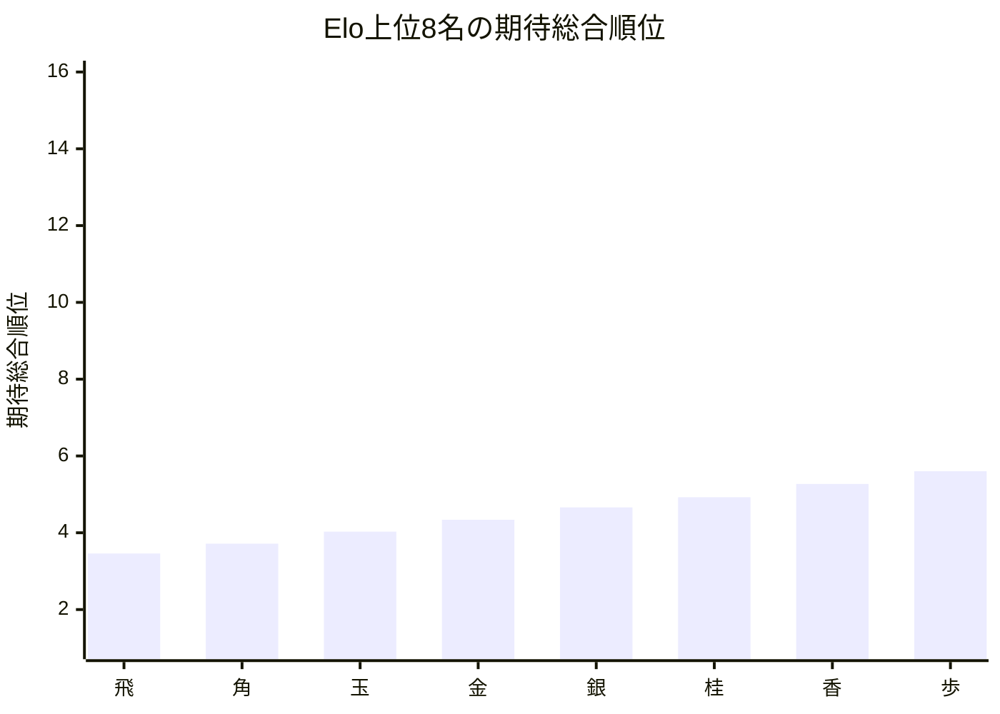
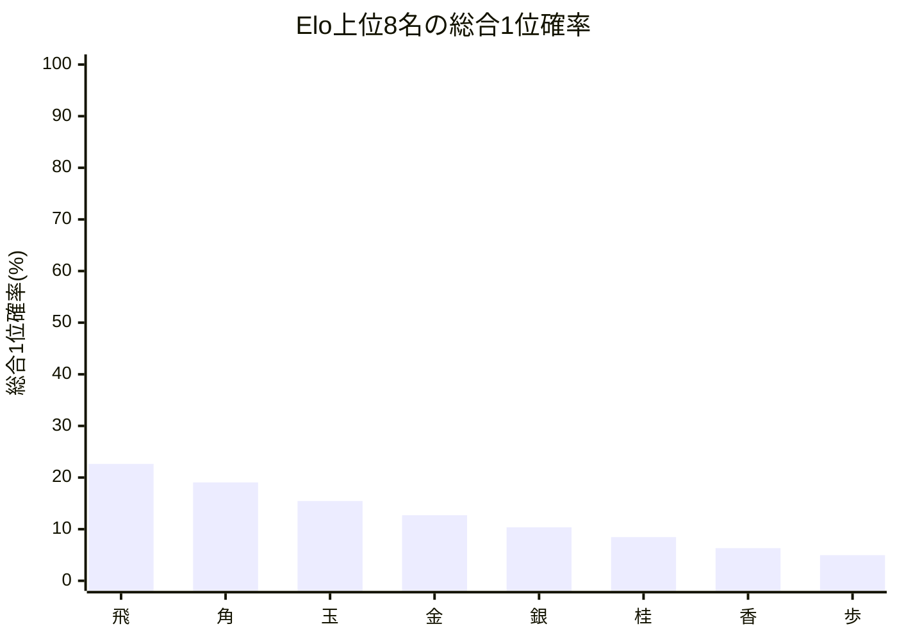

# 品質評価サマリーレポート

## 概要
- 計算モード: 本戦専用 シミュレーション (20,000回)
- 対象選手数: 16
- サマリーCSV: [quality_summary_[黒8x白8_本戦不出場Apexあり]_[Off]_modern.csv](quality_summary_[黒8x白8_本戦不出場Apexあり]_[Off]_modern.csv)
- 選手別CSV: [quality_players_20260517_133317.csv](../../Players/Bad/quality_players_20260517_133317.csv)
- 評価メモ: 現行案: 本戦不出場Apexを Innov より前の順位帯へ挿入する

## 指標サマリー
| 指標 | 値 | 意味 |
| --- | ---: | --- |
| Spearman 相関 | 0.771996 | Elo順位と期待総合順位の相関 |
| 平均順位ずれ | 2.996047 | 期待総合順位とElo順位のずれの絶対値平均 |
| Elo上位8名の総合上位8位残留人数 | 8.000000 | Elo上位8名が総合上位8位に残る人数の期待値 |
| Elo1位の総合1位確率 | 22.652994% | Elo1位が総合1位になる確率 |

## 着目選手
- 最大不利益: **飛** (+2.459750)
- 最大利益: **ひよこ** (-9.687516)
- 総合1位確率が最も高い選手: **飛**（22.65%）

## 自動コメント
- 実力順の並び: はっきり崩れています。
- 平均順位の安定感: 大きめです。
- 上位8名の残留: ほぼ完全に保たれています。
- 最強者の押し上げ: そこそこ確保されています。

### 不利益が大きい選手
| 選手 | Elo順位 | 期待総合順位 | ずれ | 総合1位確率 | 総合上位8位確率 |
| --- | ---: | ---: | ---: | ---: | ---: |
| | 飛 | 1 | 3.460 | +2.459750 | 22.65% | 100.00% | 
| | 角 | 2 | 3.716 | +1.715850 | 19.06% | 100.00% | 
| | きりん | 10 | 11.426 | +1.426254 | 0.00% | 0.00% | 

### 利益が大きい選手
| 選手 | Elo順位 | 期待総合順位 | ずれ | 総合1位確率 | 総合上位8位確率 |
| --- | ---: | ---: | ---: | ---: | ---: |
| | ひよこ | 18 | 8.312 | -9.687516 | 0.00% | 0.00% | 
| | いのしし | 17 | 8.979 | -8.020823 | 0.00% | 0.00% | 
| | うさぎ | 16 | 9.556 | -6.444280 | 0.00% | 0.00% | 

## Mermaid 図

