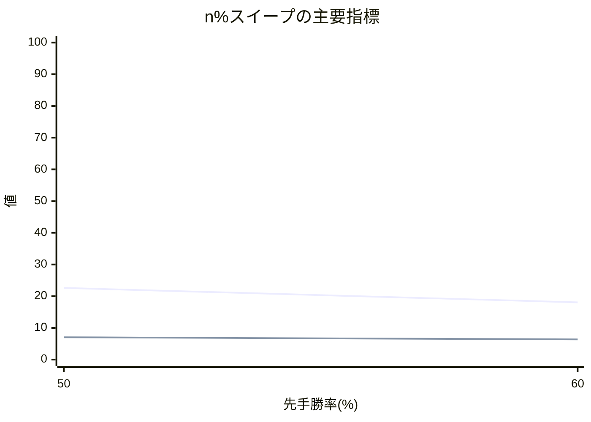

# n% スイープ結果レポート

## 概要
- 評価点数: 2
- 出力CSV: `quality_sweep_twill_commonopp_[黒8x白8]_50to100.csv`

## 注目ポイント
- Spearman 相関が最良の点: **50.00%**（1.000000）
- 平均順位ずれが最良の点: **50.00%**（1.221900）
- Elo1位の総合1位確率が最良の点: **50.00%**（22.610000%）
- 自動おすすめ帯: **50.00% 付近**

## 一覧表
| 先手勝率 | Spearman 相関 | 平均順位ずれ | Elo上位8名残留 | Elo1位の総合1位確率 | 最大不利益 | 最大利益 |
| ---: | ---: | ---: | ---: | ---: | --- | --- |
| 50.00% | 1.000000 | 1.221900 | 7.045600 | 22.610000% | 飛 (+2.668700) | ひよこ (-2.635700) |
| 60.00% | 0.950000 | 1.447917 | 6.375000 | 18.055556% | 角 (+3.166667) | ひよこ (-3.291667) |

## 推移図

