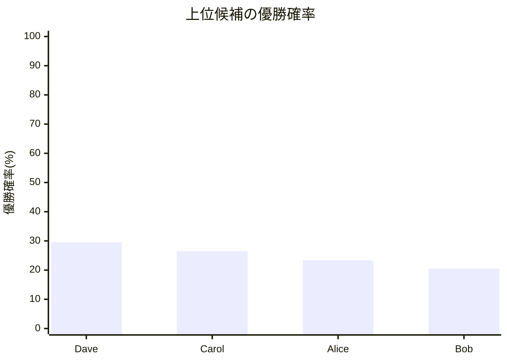
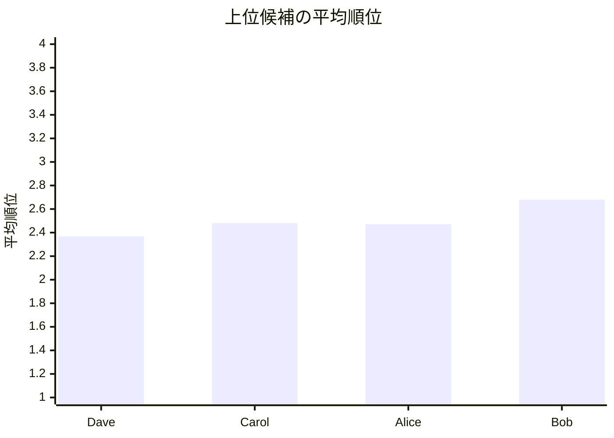

# 通常モード結果レポート

## 概要
- 結果CSV: [tournament_framework_result_[大会進行フレームワーク_Twill_最小].csv](tournament_framework_result_[大会進行フレームワーク_Twill_最小].csv)
- 計算モード: 厳密計算 / 大会進行フレームワーク / FixedMatch / Twill
- 同Elo対局時の先手勝率: 51.00%
- 対象選手数: 4

## 注目ポイント
- 優勝確率が最も高い選手: **Dave**（29.61%）
- 平均順位が最も良い選手: **Dave**（2.369）
- 実効Elo差分が最も大きくプラスの選手: **Alice**（+7）
- 実効Elo差分が最も大きくマイナスの選手: **Dave**（-7）

## 自動コメント
- 優勝候補の強さ: そこそこ確保されています。
- 先頭の平均順位: 比較的前寄りです。
- 実効Eloの押し上げ: 割り当てや対戦構成の影響はかなり小さめです。

## 上位候補一覧
| 選手 | 元Elo | 実効Elo | 差分 | 優勝確率 | 平均順位 |
| --- | ---: | ---: | ---: | ---: | ---: |
| Dave | 1470 | 1463 | -7 | 29.61% | 2.369 |
| Carol | 1520 | 1520 | 0 | 26.51% | 2.480 |
| Alice | 1500 | 1507 | +7 | 23.34% | 2.471 |
| Bob | 1480 | 1480 | 0 | 20.54% | 2.680 |

## Mermaid 図

