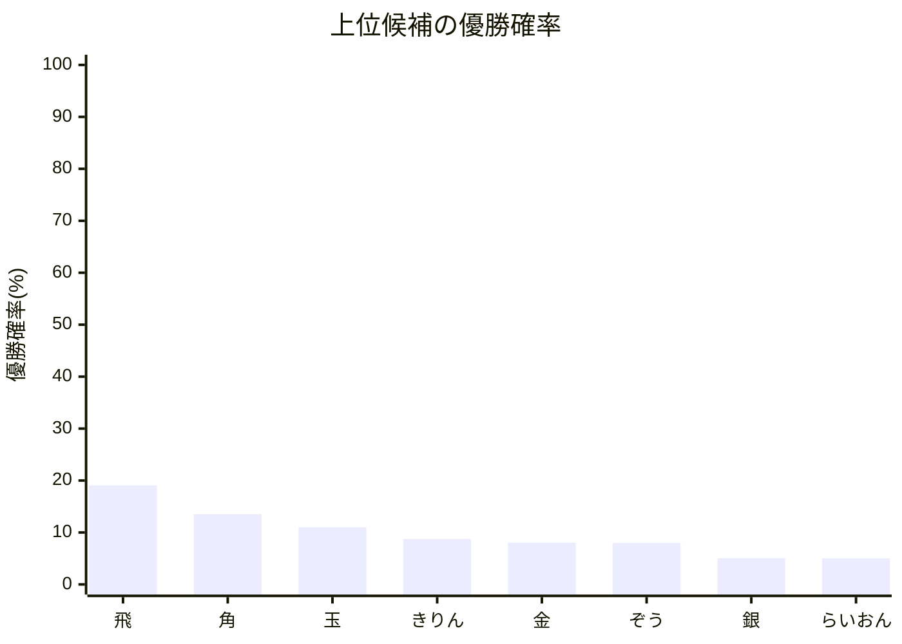
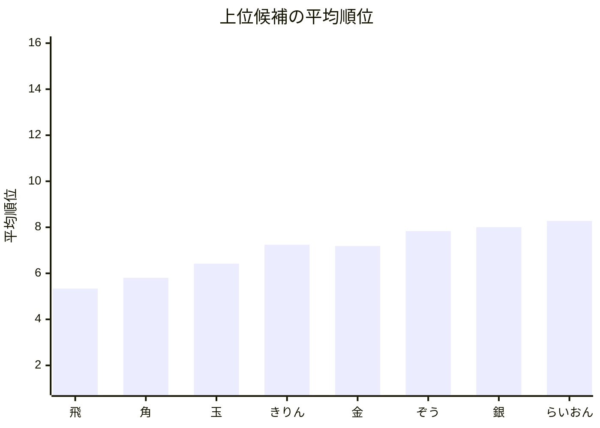

# 通常モード結果レポート

## 概要
- 結果CSV: [tournament_framework_result_[大会進行フレームワーク_先手8x後手8_Twill].csv](tournament_framework_result_[大会進行フレームワーク_先手8x後手8_Twill].csv)
- 計算モード: 大会進行フレームワーク / FixedMatch / Twill (889/2,000回, 時間切れ)
- 同Elo対局時の先手勝率: 70.00%
- 対象選手数: 16

## 注目ポイント
- 優勝確率が最も高い選手: **飛**（19.07%）
- 平均順位が最も良い選手: **飛**（5.337）
- 実効Elo差分が最も大きくプラスの選手: **いぬ**（+147）
- 実効Elo差分が最も大きくマイナスの選手: **桂**（-147）

## 自動コメント
- 優勝候補の強さ: やや弱めです。
- 先頭の平均順位: まだ混戦気味です。
- 実効Eloの押し上げ: 割り当てや対戦構成の影響がかなり大きいです。

## 上位候補一覧
| 選手 | 元Elo | 実効Elo | 差分 | 優勝確率 | 平均順位 |
| --- | ---: | ---: | ---: | ---: | ---: |
| 飛 | 5050 | 4903 | -147 | 19.07% | 5.337 |
| 角 | 5030 | 4883 | -147 | 13.52% | 5.805 |
| 玉 | 5010 | 4863 | -147 | 11.00% | 6.422 |
| きりん | 4890 | 5037 | +147 | 8.74% | 7.244 |
| 金 | 4990 | 4843 | -147 | 8.04% | 7.189 |
| ぞう | 4870 | 5017 | +147 | 8.00% | 7.835 |
| 銀 | 4970 | 4823 | -147 | 5.04% | 8.008 |
| らいおん | 4850 | 4997 | +147 | 5.02% | 8.276 |

## Mermaid 図

