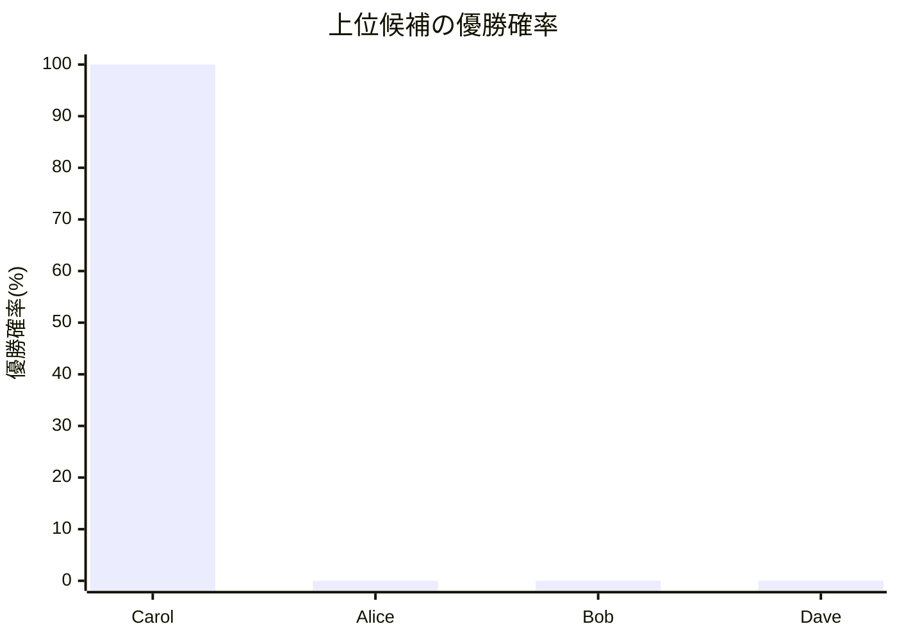
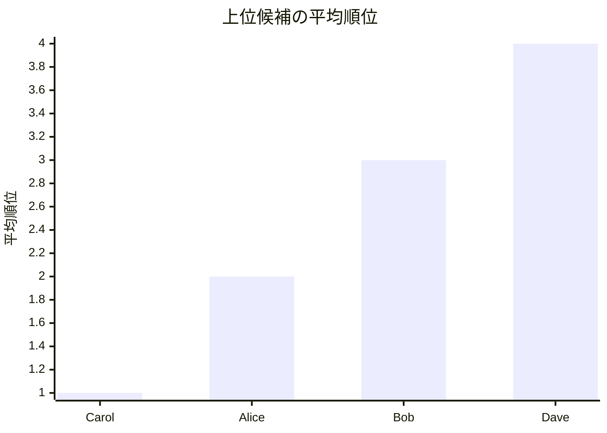

# 通常モード結果レポート

## 概要
- 結果CSV: [tournament_framework_result_[大会進行フレームワーク_最小].csv](tournament_framework_result_[大会進行フレームワーク_最小].csv)
- 計算モード: 大会進行フレームワーク / FixedMatch
- 同Elo対局時の先手勝率: 51.00%
- 対象選手数: 4

## 注目ポイント
- 優勝確率が最も高い選手: **Carol**（100.00%）
- 平均順位が最も良い選手: **Carol**（1.000）
- 実効Elo差分が最も大きくプラスの選手: **Alice**（+7）
- 実効Elo差分が最も大きくマイナスの選手: **Dave**（-7）

## 自動コメント
- 優勝候補の強さ: かなり強いです。
- 先頭の平均順位: かなり前寄りです。
- 実効Eloの押し上げ: 割り当てや対戦構成の影響はかなり小さめです。

## 上位候補一覧
| 選手 | 元Elo | 実効Elo | 差分 | 優勝確率 | 平均順位 |
| --- | ---: | ---: | ---: | ---: | ---: |
| Carol | 1520 | 1520 | 0 | 100.00% | 1.000 |
| Alice | 1500 | 1507 | +7 | 0.00% | 2.000 |
| Bob | 1480 | 1480 | 0 | 0.00% | 3.000 |
| Dave | 1470 | 1463 | -7 | 0.00% | 4.000 |

## Mermaid 図

