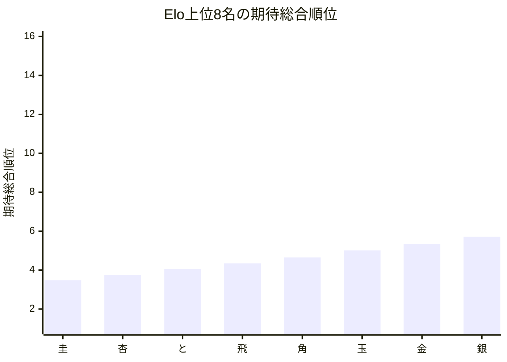
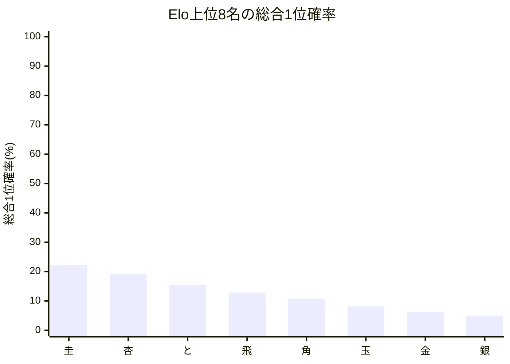

# 品質評価サマリーレポート

## 概要
- 計算モード: 本戦専用 シミュレーション (20,000回)
- 対象選手数: 16
- サマリーCSV: [quality_summary_[トップ集団大きめ].csv](quality_summary_[トップ集団大きめ].csv)
- 選手別CSV: [quality_players_20260517_152429.csv](quality_players_20260517_152429.csv)

## 指標サマリー
| 指標 | 値 | 意味 |
| --- | ---: | --- |
| Spearman 相関 | 1.000000 | Elo順位と期待総合順位の相関 |
| 平均順位ずれ | 1.399885 | 期待総合順位とElo順位のずれの絶対値平均 |
| Elo上位8名の総合上位8位残留人数 | 7.644672 | Elo上位8名が総合上位8位に残る人数の期待値 |
| Elo1位の総合1位確率 | 22.184161% | Elo1位が総合1位になる確率 |

## 着目選手
- 最大不利益: **圭** (+2.479066)
- 最大利益: **ねこ** (-3.356923)
- 総合1位確率が最も高い選手: **圭**（22.18%）

## 自動コメント
- 実力順の並び: かなり強く保たれています。
- 平均順位の安定感: 比較的おだやかです。
- 上位8名の残留: かなり保たれています。
- 最強者の押し上げ: そこそこ確保されています。

### 不利益が大きい選手
| 選手 | Elo順位 | 期待総合順位 | ずれ | 総合1位確率 | 総合上位8位確率 |
| --- | ---: | ---: | ---: | ---: | ---: |
| | 圭 | 1 | 3.479 | +2.479066 | 22.18% | 98.94% | 
| | 杏 | 2 | 3.746 | +1.745873 | 19.21% | 98.48% | 
| | 桂 | 9 | 11.125 | +1.124788 | 0.00% | 11.26% | 

### 利益が大きい選手
| 選手 | Elo順位 | 期待総合順位 | ずれ | 総合1位確率 | 総合上位8位確率 |
| --- | ---: | ---: | ---: | ---: | ---: |
| | ねこ | 16 | 13.643 | -3.356923 | 0.00% | 0.84% | 
| | いぬ | 15 | 13.353 | -2.646771 | 0.00% | 1.17% | 
| | 銀 | 8 | 5.717 | -2.282565 | 4.99% | 89.48% | 

## Mermaid 図

