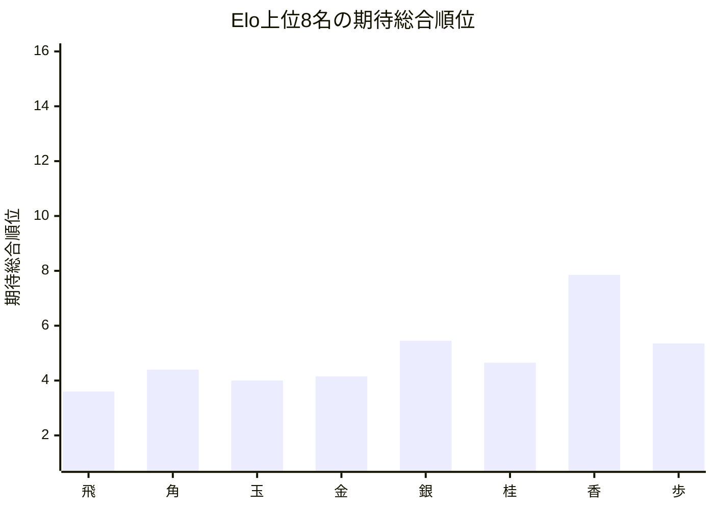
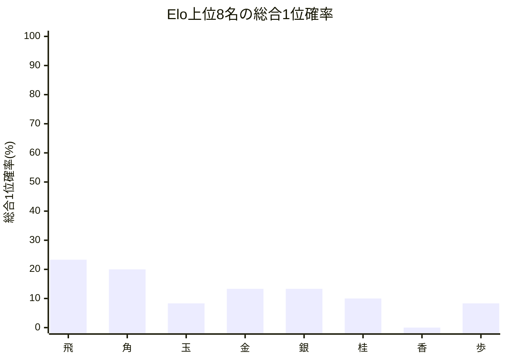

# 品質評価サマリーレポート

## 概要
- 計算モード: シミュレーション (10回)
- 対象選手数: 16
- サマリーCSV: [quality_summary_[先手8x後手8]_[Neutral_Single10_STSAInput2_draft].csv](quality_summary_[先手8x後手8]_[Neutral_Single10_STSAInput2_draft].csv)
- 選手別CSV: [quality_players_20260523_144521.csv](quality_players_20260523_144521.csv)

## 指標サマリー
| 指標 | 値 | 意味 |
| --- | ---: | --- |
| Spearman 相関 | 0.966888 | Elo順位と期待総合順位の相関 |
| 平均順位ずれ | 1.275000 | 期待総合順位とElo順位のずれの絶対値平均 |
| Elo上位8名の総合上位8位残留人数 | 7.106667 | Elo上位8名が総合上位8位に残る人数の期待値 |
| Elo1位の総合1位確率 | 23.333333% | Elo1位が総合1位になる確率 |

## 着目選手
- 最大不利益: **飛** (+2.600000)
- 最大利益: **ひよこ** (-3.250000)
- 総合1位確率が最も高い選手: **飛**（23.33%）

## 自動コメント
- 実力順の並び: 少し崩れ始めています。
- 平均順位の安定感: 比較的おだやかです。
- 上位8名の残留: 少し崩れています。
- 最強者の押し上げ: そこそこ確保されています。

### 不利益が大きい選手
| 選手 | Elo順位 | 期待総合順位 | ずれ | 総合1位確率 | 総合上位8位確率 |
| --- | ---: | ---: | ---: | ---: | ---: |
| | 飛 | 1 | 3.600 | +2.600000 | 23.33% | 100.00% | 
| | 角 | 2 | 4.400 | +2.400000 | 20.00% | 90.00% | 
| | らいおん | 11 | 12.050 | +1.050000 | 0.00% | 2.00% | 

### 利益が大きい選手
| 選手 | Elo順位 | 期待総合順位 | ずれ | 総合1位確率 | 総合上位8位確率 |
| --- | ---: | ---: | ---: | ---: | ---: |
| | ひよこ | 16 | 12.750 | -3.250000 | 0.00% | 10.00% | 
| | 歩 | 8 | 5.350 | -2.650000 | 8.33% | 88.67% | 
| | うさぎ | 14 | 12.500 | -1.500000 | 0.00% | 15.00% | 

## Mermaid 図

## 次回の具体設定案
- 次回の品質評価提案
  - 同Elo対局時の先手勝率(%) = 51.00
  - シミュレーション試行回数 = 1,000
- 理由: 今回の条件で回せたので、同条件を基準に比較を続けられます。
