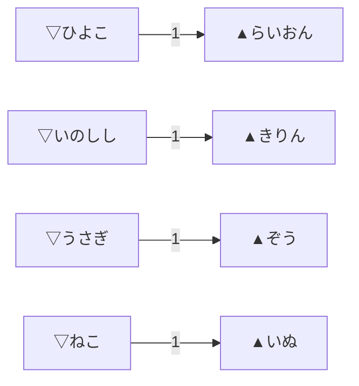
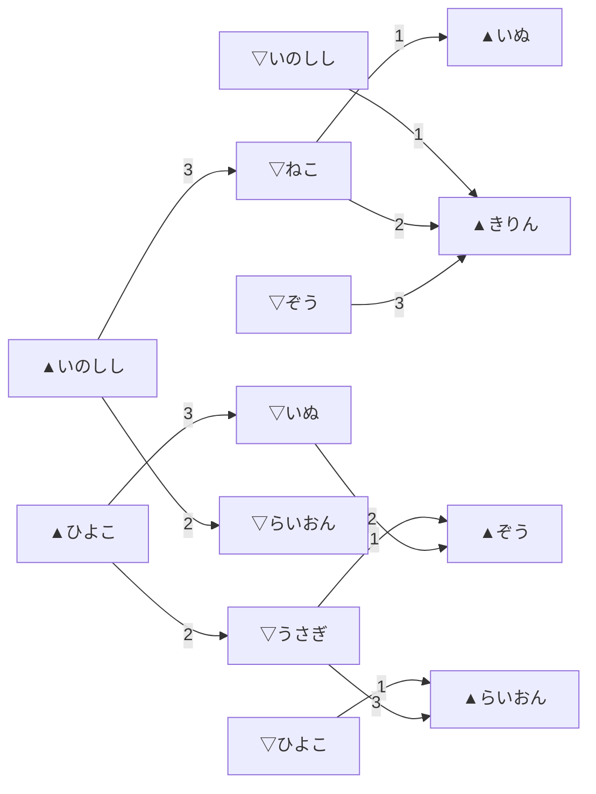
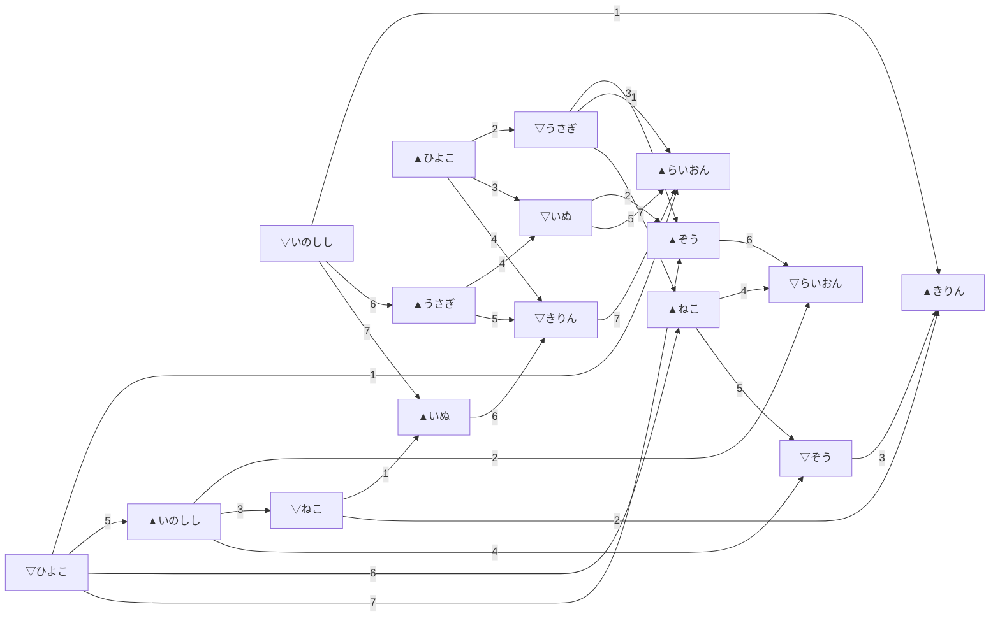

# 【ツイル式トーナメント草案 3】8人モデル（先手勝率50%）

※ 旧題: `【大会ルール案】格付けグラフ戦_4`  
ツイル式トーナメントの 8 人サンプルを、先手勝率 50% ケースで図示した基準草案。

※ この文書は **先手勝率 50% ケース** を記録したもの。  
60 / 70 / 80 / 90 / 100% の比較は `【大会ルール案】格付けグラフ戦_4_先手勝率スイープ.md` を参照。

## プレイヤー

```
名前　　　強さ
らいおん　3950
きりん　　3800
ぞう　　　3650
いぬ　　　3550
ねこ　　　3400
うさぎ　　3200
いのしし　3000
ひよこ　　2700
```

## 対局表

数字はラウンド。  

```
　　　　　らいおん　きりん　　ぞう　　　いぬ　　　ねこ　　　うさぎ　　いのしし　ひよこ
らいおん　 ‐　　　  7▲　　　 6▽　　　 5▲　　　 4▽　　　 3▲　　　 2▽　　　 1▲
きりん　　 7▽　　　‐　　　　 3▲　　　 6▽　　　 2▲　　　 5▽　　　 1▲　　　 4▽
ぞう　　　 6▲　　　 3▽　　　‐　　　　 2▲　　　 5▽　　　 1▲　　　 4▽　　　 7▲
いぬ　　　 5▽　　　 6▲　　　 2▽　　　‐　　　　 1▲　　　 4▽　　　 7▲　　　 3▽
ねこ　　　 4▲　　　 2▽　　　 5▲　　　 1▽　　　‐　　　　 7▲　　　 3▽　　　 6▲
うさぎ　　 3▽　　　 5▲　　　 1▽　　　 4▲　　　 7▽　　　‐　　　　 6▲　　　 2▽
いのしし　 2▲　　　 1▽　　　 4▲　　　 7▽　　　 3▲　　　 6▽　　　‐　　　　 5▲
ひよこ　　 1▽　　　 4▲　　　 7▽　　　 3▲　　　 6▽　　　 2▲　　　 5▽　　　‐
```

## １ラウンドごとにグラフを作っていく

ホワイトボードに結果を、指向性グラフとして記録する。  
この案では、**同じプレイヤーでも先後が違えば別ノード**として扱う。  
例えば `▲らいおん` と `▽らいおん` は別ノードである。  

ここでは図を作りやすくするため、**例として「強さが大きい方が勝つ」**ケースを示す。  
したがって、ラウンドによっては `▽` 側が勝つこともあれば、`▲` 側が勝つこともある。  

## 記号

- `▽名前` = その対局で `▽` 側だったノード
- `▲名前` = その対局で `▲` 側だったノード
- 矢印 `A → B` = `A` が負け、`B` が勝った

言い換えると、**矢印は「負けた側から勝った側へ」向ける**。  

また、**同じ `▲/▽` と同じ名前なら、ラウンドが違っても同じノードとしてつなげて読む**。  
例えば `▲ひよこ → ▽うさぎ` と `▽うさぎ → ▲らいおん` があれば、  
`▲ひよこ → ▽うさぎ → ▲らいおん` という 1 本の道として見てよい。  

## ラウンドごとの対局一覧

対局表をラウンドごとに読み直すと、次の 7 ラウンドになる。  

### Round 1

- ひよこ `▽` - `▲` らいおん
- いのしし `▽` - `▲` きりん
- うさぎ `▽` - `▲` ぞう
- ねこ `▽` - `▲` いぬ

### Round 2

- らいおん `▽` - `▲` いのしし
- ねこ `▽` - `▲` きりん
- いぬ `▽` - `▲` ぞう
- うさぎ `▽` - `▲` ひよこ

### Round 3

- うさぎ `▽` - `▲` らいおん
- ぞう `▽` - `▲` きりん
- いぬ `▽` - `▲` ひよこ
- ねこ `▽` - `▲` いのしし

### Round 4

- らいおん `▽` - `▲` ねこ
- きりん `▽` - `▲` ひよこ
- ぞう `▽` - `▲` いのしし
- いぬ `▽` - `▲` うさぎ

### Round 5

- いぬ `▽` - `▲` らいおん
- きりん `▽` - `▲` うさぎ
- ぞう `▽` - `▲` ねこ
- ひよこ `▽` - `▲` いのしし

### Round 6

- らいおん `▽` - `▲` ぞう
- きりん `▽` - `▲` いぬ
- ひよこ `▽` - `▲` ねこ
- いのしし `▽` - `▲` うさぎ

### Round 7

- きりん `▽` - `▲` らいおん
- ひよこ `▽` - `▲` ぞう
- いのしし `▽` - `▲` いぬ
- うさぎ `▽` - `▲` ねこ

## Round 1 の結果グラフ

まず 1 ラウンド目だけをホワイトボードへ書くと、次のようになる。  



この時点では、4 本の独立した辺しかない。  
まだ全体順位を語るには情報が少なく、**4 つの小さい成分に分かれている**だけである。  

## Round 1〜3 を重ねたグラフ

3 ラウンドまで重ねると、だいぶ形が見えてくる。  



この図から分かるのは、強い側のノード、つまり

- `▲らいおん`
- `▽らいおん`
- `▲きりん`
- `▲ぞう`

のようなノードの周辺へ、枝が少しずつ集まり始めること。  
例えば、`▲ひよこ → ▽うさぎ → ▲らいおん` という経路ができるので、  
**ひよこよりうさぎ、うさぎよりらいおん** という比較が 1 本の道として読める。  
ただし、まだ**全体が 1 つの大きな連結構造になったとは言いがたい**。  

## Round 1〜7 を全部重ねた完成イメージ

7 ラウンド全部を重ねると、こういう完成図になる。  



この図は見た目には複雑だが、発想は単純である。  
**各ラウンドの勝敗を、負け→勝ちの矢印として追加していくだけ**でよい。  
しかも、同じ名前・同じ先後のノードをつなげて描けば、  
**複数ラウンドにまたがる比較の道** がそのまま見える。  

## このグラフで何を見るのか

格付けグラフ戦で見たいのは、主に次の点である。  

### 1. どのプレイヤーが上位帯へ流れ込んでいるか

多くの矢印が集まるノードは、

- そのラウンドでは勝ち役になっている
- 他プレイヤーとの比較で優勢だった

と見やすい。  

### 2. どこに未接続の塊が残っているか

グラフがいくつもの塊に分かれたままだと、

- 「この塊とあの塊の上下関係」がまだ分からない
- 比較不能な帯が残っている

ということになる。  
この場合は、次ラウンドで**別の塊を橋渡しする対局**を優先したくなる。  

### 3. 境界帯がどこにあるか

上位帯と下位帯の間に、

- 勝ったり負けたりが交錯する帯
- どちらへも枝が伸びる帯

が現れたら、そこが**境界帯**である。  
この境界帯を厚く見るのか、細く切るのかが大会ルールの個性になる。  

## 仮の順位付け方法

この案では、最終順位の付け方を最初から 1 つに固定しなくてもよい。  
とりあえず次の順で読むと分かりやすい。  

1. まず連結成分を見る
2. 次に成分どうしの橋渡し辺を見る
3. さらに、あるノードへ流れ込む矢印の多さを見る
4. 最後に、必要なら成分内だけ追加対局を入れる

つまり、**最初から全順位を精密に決めるというより、比較可能なグラフを育てる**感覚である。  

## この方式の良いところ

- ラウンドごとに図が成長していくので、観客に見せやすい
- 「誰がどの帯に食い込んだか」を視覚化しやすい
- 途中経過で、次ラウンドの組み合わせ方針を説明しやすい
- 完全な総当たりでなくても、比較のつながりを意識できる

## この方式の難しいところ

- グラフが複雑になると、最終順位の決め方が別途必要
- 先後を分けてノードを増やすので、図が大きくなりやすい
- 成分がきれいにつながらないと、順位の説得力が落ちやすい
- 実戦で使うには、追加対局の入れ方と終了条件を明文化したい

## 実戦向けに詰めたい点

実際の大会ルールに寄せるなら、少なくとも次は決めておきたい。  

1. **次ラウンドの組み方**
   - 未接続成分をつなぐのを優先するのか
   - 境界帯を厚く観測するのを優先するのか

2. **終了条件**
   - 何ラウンドで打ち切るか
   - どの程度つながったら「十分比較できた」とみなすか

3. **最終順位の読み方**
   - 連結成分単位で段階順位にするか
   - 追加の決定戦を入れるか
   - 到達可能性や縮約グラフで読むか

## まとめ

この `格付けグラフ戦_4` は、8 人版の小さいモデルである。  

- 対局表を先に用意する
- 各ラウンド結果を矢印で足す
- できたグラフを見て、次の橋渡しや境界帯を考える

という流れを、Mermaid でかなり素直に見せられる。  

大会ルールとして完成させるには、

- グラフから最終順位をどう読むか
- どこで対局を打ち切るか

の 2 点をさらに詰めたい。  
ただし、**「順位表」ではなく「比較グラフ」を育てていく大会**としては、かなり面白い見せ方ができる案である。  

