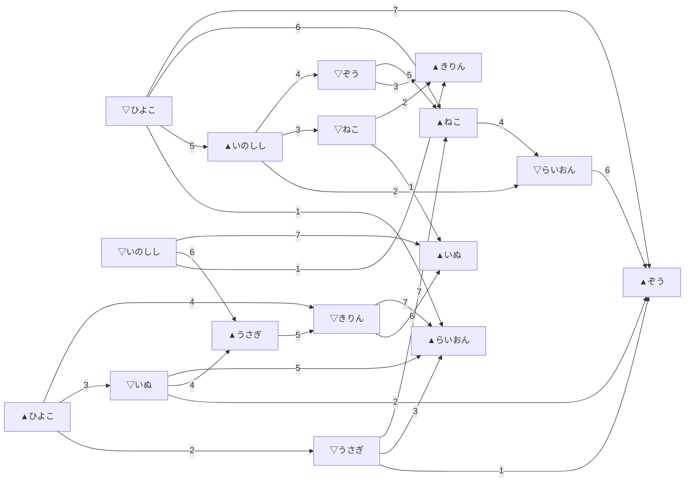
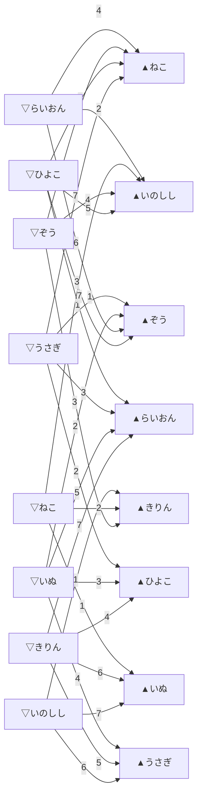

# 【ツイル式トーナメント草案 4】8人モデル先手勝率スイープ

※ 旧題: `【大会ルール案】格付けグラフ戦_4_先手勝率スイープ`  
草案 3 を基準に、先手勝率を 60 / 70 / 80 / 90 / 100% へ振った比較メモ。

`【ツイル式トーナメント草案 3】8人モデル（先手勝率50%）.md` を **先手勝率 50% ケース** とし、  
ここでは 60 / 70 / 80 / 90 / 100% を並べて比較する。

## プレイヤー

```
名前　　　強さ
らいおん　3950
きりん　　3800
ぞう　　　3650
いぬ　　　3550
ねこ　　　3400
うさぎ　　3200
いのしし　3000
ひよこ　　2700
```

## 前提

- `▲` を先手、`▽` を後手とみなす
- 先手勝率 `n%` は、先手側へ Elo 補正を与えたのと同じ意味で読む
- ここでは確率分布をそのまま描くのではなく、**先手補正込みで見たときに強い方が勝つ**と仮定して図を描く
- 矢印は「負けた側 → 勝った側」へ向ける
- 同じ `▲/▽` と同じ名前なら、ラウンドをまたいでも同じノードとしてつなげて読む

## ざっくり比較表

| 先手勝率 | 先手補正の Elo 相当 | 50% ケースからの変化 |
|---|---:|---|
| 60% | 約 +70.4 | 変化なし |
| 70% | 約 +147.2 | 変化なし |
| 80% | 約 +240.8 | 変化なし |
| 90% | 約 +381.7 | 4 対局が反転 |
| 100% | 無限大 | ▲ 側が全勝、12 対局が反転 |

この 8 人表では、**先手補正が 80% まではまだ小さく、50% ケースと同じ勝敗図になる**。  
最初に反転が起きるのは 90% ケースである。  

## 60% ケース

60% は先手補正が約 +70.4 Elo 相当で、まだ小さい。  
この対局表では、先手が弱い側に回っている対局でも、ひっくり返すには足りない。  
したがって、**図は 50% ケースと同じ**である。

- 変化した対局: なし
- 読み方: `【ツイル式トーナメント草案 3】8人モデル（先手勝率50%）.md` と同じ

## 70% ケース

70% は先手補正が約 +147.2 Elo 相当。  
それでも、この 8 人表で先手不利側を覆すにはまだ足りない。  
したがって、**図は 50% ケースと同じ**である。

- 変化した対局: なし
- 読み方: `【大会ルール案】格付けグラフ戦_4.md` と同じ

## 80% ケース

80% は先手補正が約 +240.8 Elo 相当。  
かなり大きいが、それでも最初にひっくり返る境界にはまだ届かない。  
この表では、最初に反転する候補のひとつが

- `▽ぞう` vs `▲ねこ`
- `▽きりん` vs `▲いぬ`

のような約 250 Elo 差の対局であり、80% ではまだ一歩届かない。  
したがって、**図は 50% ケースと同じ**である。

- 変化した対局: なし
- 読み方: `【大会ルール案】格付けグラフ戦_4.md` と同じ

## 90% ケース

90% では先手補正が約 +381.7 Elo 相当になり、いくつかの対局が反転する。  
50% ケースから変わるのは次の 4 対局である。

- Round 4: `▽いぬ → ▲うさぎ`
- Round 5: `▽ぞう → ▲ねこ`
- Round 6: `▽らいおん → ▲ぞう`
- Round 6: `▽きりん → ▲いぬ`

つまり、**中位帯の先手側がかなり食い返せる**ようになる。  
50% では後手の格上が勝っていた枝が、90% では先手側の枝に置き換わり始める。



このケースでは、例えば

- `▲ひよこ → ▽うさぎ → ▲らいおん`
- `▽いぬ → ▲うさぎ → ▽きりん → ▲らいおん`

のような道が見える。  
先手補正が強くなると、**中位プレイヤーを経由した食い込みの道** が濃くなる。

## 100% ケース

100% では、▲ 側が必ず勝つ。  
したがって、各対局はすべて **`▽側 → ▲側`** になる。  
50% ケースから反転するのは次の 12 対局である。

- Round 2: `▽らいおん → ▲いのしし`
- Round 2: `▽うさぎ → ▲ひよこ`
- Round 3: `▽いぬ → ▲ひよこ`
- Round 3: `▽ねこ → ▲いのしし`
- Round 4: `▽らいおん → ▲ねこ`
- Round 4: `▽きりん → ▲ひよこ`
- Round 4: `▽ぞう → ▲いのしし`
- Round 4: `▽いぬ → ▲うさぎ`
- Round 5: `▽きりん → ▲うさぎ`
- Round 5: `▽ぞう → ▲ねこ`
- Round 6: `▽らいおん → ▲ぞう`
- Round 6: `▽きりん → ▲いぬ`



100% ケースでは、ノードの流れがかなり単純化される。  
後手の格上が耐える構図が消えて、**先手を取った側へ矢印が集まり続ける図** になる。  
そのため、このケースは「実力比較グラフ」というより、**先手配置グラフ** に近づく。

## まとめ

- 60 / 70 / 80% は、この 8 人表では **50% ケースと同じ図** になる
- 最初に見た目が変わるのは 90%
- 100% では、勝敗は完全に先手配置で決まる

したがって、この対局表では

- **50〜80%**: 実力順の骨格がまだ保たれる帯
- **90%**: 中位帯から先手食い込みが見え始める帯
- **100%**: 先手配置が支配的になる帯

と読める。  
図として面白くなるのは 90% 以降だが、**大会ルールとして自然なのは 50〜80% 側**だと考えられる。  
