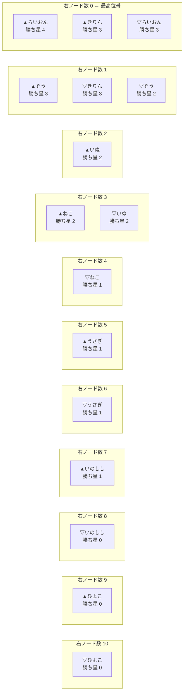
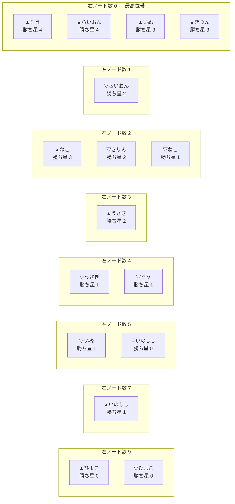
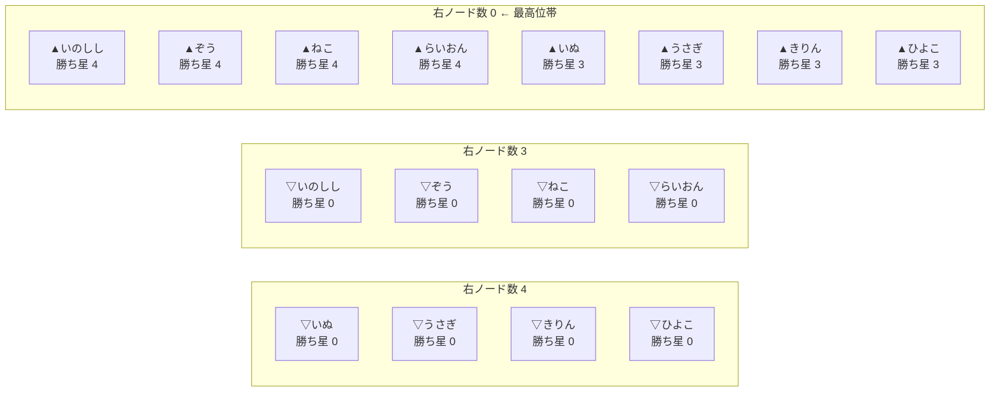
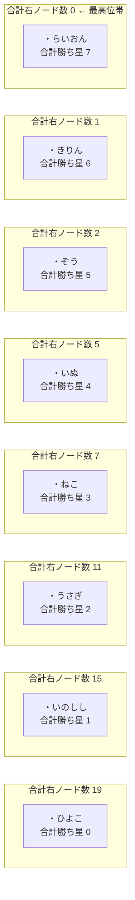
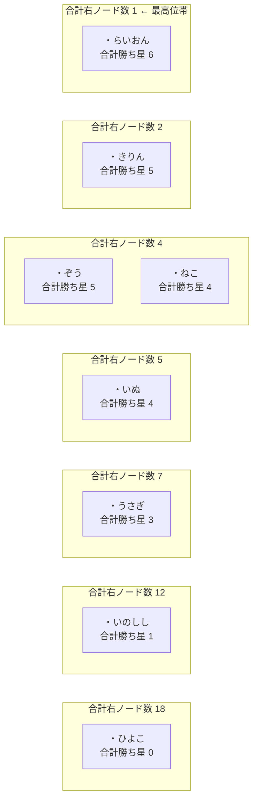
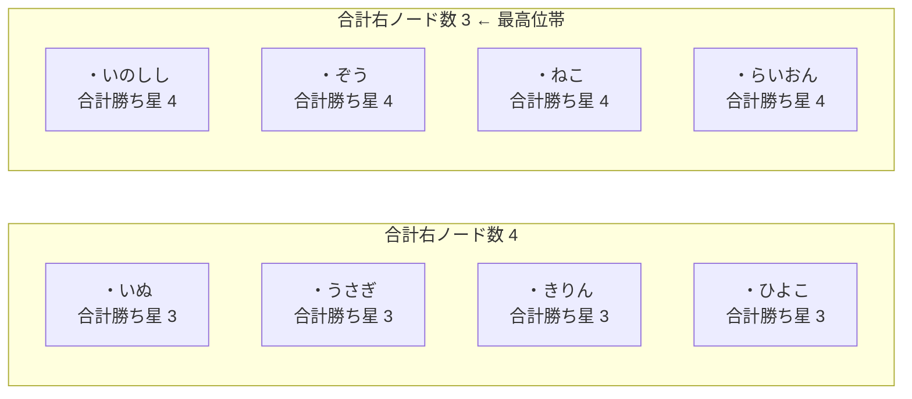
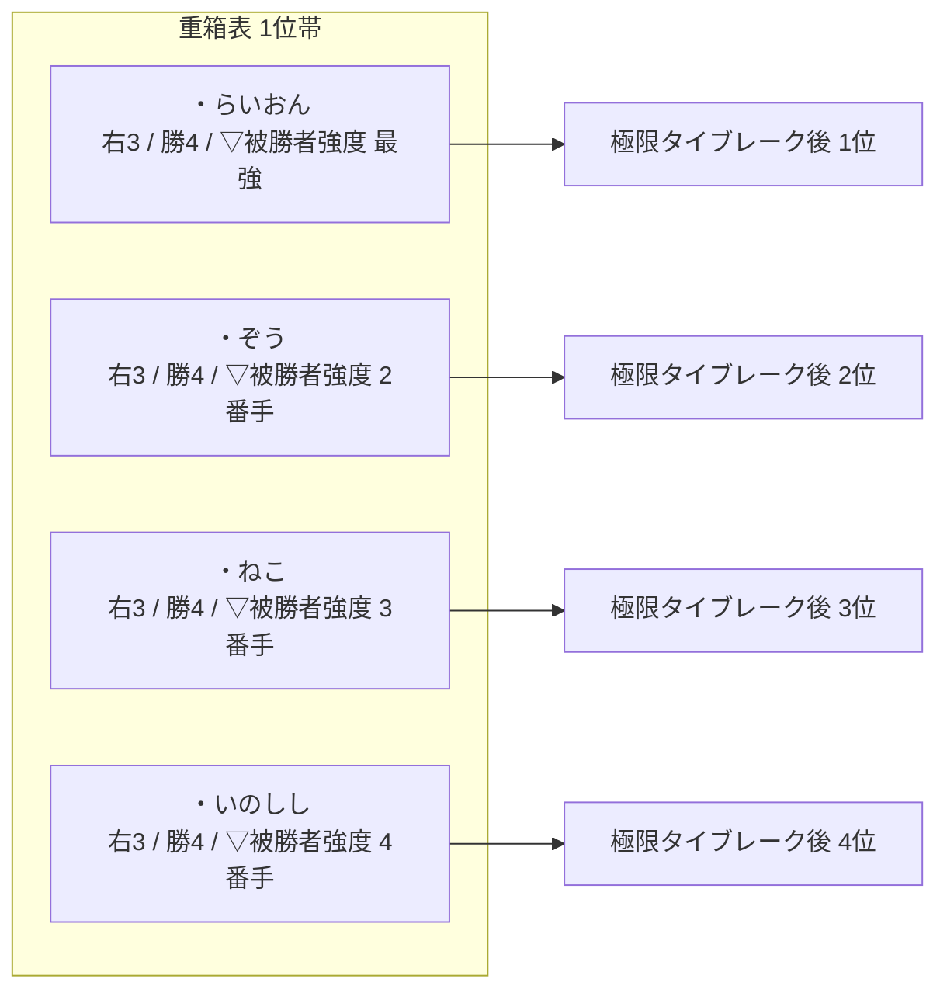

# 【ツイル式トーナメント草案 5】重箱表と順位案

※ 旧題: `【大会ルール案】格付けグラフ戦_4_右ノード順位案`  
右ノード順位図、重箱表、最長経路、タイブレーク案をまとめた順位設計メモ。

`【大会ルール案】格付けグラフ戦_4.md` と `【大会ルール案】格付けグラフ戦_4_先手勝率スイープ.md` の図をもとに、  
**「右にあるノードが少ないほど高順位」** という見方を、試しに図へしてみる。

## 仮の読み方

この文書では、各ノード `N` について次を数える。

- `右ノード数` = `N` から矢印をたどって、右側へ到達できるノードの個数
- `勝ち星` = そのノードへ入ってくる矢印の本数

そして順位帯を、次の順で決める。

1. **右ノード数が少ないほど高順位**
2. 同じ右ノード数なら、**上から勝ち星が多い順**
3. 同じ右ノード数・同じ勝ち星なら、ここでは同順位帯のまま並べる

つまり、**右端に近いほど偉い**、ただし同じ列の中では**勝ち星が多いものを上へ置く**という案である。

## 注意

この順位案は、まだ **プレイヤー順位ではなくノード順位** である。  
したがって、

- `▲らいおん`
- `▽らいおん`

は別ノードとして別々に現れる。  
最終的にプレイヤー順位へ戻すには、あとで

- `▲/▽` をまとめるか
- 片側だけ採用するか
- 平均や上位側を採るか

など、もう一段ルールが必要である。

## 先手勝率スイープの結論だけ先に

| 先手勝率 | 順位図の変化 | 最上位帯（右ノード数 0） |
|---|---|---|
| 50% | 基準ケース | `▲らいおん`, `▲きりん`, `▽らいおん` |
| 60% | 変化なし | 50% と同じ |
| 70% | 変化なし | 50% と同じ |
| 80% | 変化なし | 50% と同じ |
| 90% | 中位の先手食い込みで変化 | `▲ぞう`, `▲らいおん`, `▲いぬ`, `▲きりん` |
| 100% | ▲側が最上位帯を独占 | すべての `▲` ノード |

この 8 人表では、**50〜80% は同じ順位図** になり、  
最初に見た目が変わるのは 90% からである。

## 50% ケース

50% は `【大会ルール案】格付けグラフ戦_4.md` と同じ。  
右端ほど高順位になるよう、列を **左から右へ 10, 9, ..., 0** の順で並べる。  
つまり、**右端の列が最高位帯** である。

この見方だと、50% ケースでは

- 右端に `▲らいおん`, `▲きりん`, `▽らいおん`
- その 1 列左に `▲ぞう`, `▽きりん`, `▽ぞう`

が来る。  
つまり、**らいおん・きりん付近のノードが最終的な行き止まり**になっている。

## 60% / 70% / 80% ケース

この 8 人表では、60 / 70 / 80% は勝敗図が 50% と変わらない。  
したがって、**右ノード順位図も 50% ケースと同じ**である。

- 60%: 50% と同じ
- 70%: 50% と同じ
- 80%: 50% と同じ

この点は逆に面白くて、**グラフの勝敗構造が変わらない限り、順位図も動かない**。  
この方式は、先手勝率の数値そのものより、**勝敗パターンの変化点**に強く反応する。

## 90% ケース

90% では中位帯の 4 対局が反転し、順位図も変わる。  
このときの列配置は次のようになる。

50% ケースと比べると、

- `▲ぞう`
- `▲いぬ`

が最上位帯へ食い込んでくる。  
つまり、**先手補正が強くなると、右端の最高位帯が厚くなる**。

これは、

- 後手の格上が最後まで耐えていた構図が崩れ
- 先手を引いた中位ノードが、右端まで届く

ということを意味している。

## 100% ケース

100% ではすべての対局が `▽ → ▲` になり、▲ 側ノードが一気に右端へ寄る。  
図は次のようにかなり単純になる。

100% では、**右ノード数 0 の列にすべての ▲ ノードが並ぶ**。  
つまり、この順位案は 100% ケースでは

- 実力比較図というより
- ほぼ先手配置の勝ち残り表

になる。  
このときは「右ノード数が少ないほど高順位」という考え方そのものは残っているが、  
図の意味はかなり変質する。

## この順位案の面白いところ

- グラフそのものを、そのまま**帯状の順位図**へ読み替えられる
- 「右へ抜けたノードほど上位」という直感がある
- 同じ列の中は勝ち星順に並べるので、図として見やすい
- 50〜80% が同形、90% で変化、100% で崩壊、という変化点がよく分かる

## この順位案の難しいところ

- `▲らいおん` と `▽らいおん` をどうプレイヤー順位へ戻すかが未解決
- `右ノード数` を「直接右」ではなく「到達可能な右全体」で数えるので、説明が少し要る
- 同順位帯で勝ち星も同じなら、さらにタイブレークが必要
- 循環や相互食い込みが濃くなると、右ノード数だけでは整理しきれない可能性がある

## 仮まとめ

試してみる価値はかなりある。  
特に、**図を順位表のように読む入口** としては面白い。  

今回の 8 人モデルで見ると、

- 50〜80%: 右端は少数の強ノードに絞られる
- 90%: 中位の先手ノードが右端へ食い込む
- 100%: ▲ 側が一斉に右端へ並ぶ

となった。  
したがって、この順位案は

- **中程度の先手補正までは、かなり見やすい**
- **極端な先手有利では、先手配置を映す図に寄っていく**

という性質がありそうである。  
別案としては、次に

- `▲/▽` をプレイヤーごとに 1 つへまとめた順位図
- 右ノード数ではなく「最長経路長」で読む順位図
- 縮約グラフで帯を作る順位図

も試せそうである。

## 重箱表（`▲/▽` を単純加算した `・名前` 版）

ここから先は、上の図を**参考図として残したまま**、  
`▲らいおん` と `▽らいおん` を単純に加算した **`・らいおん`** を作る案を試す。  
この aggregated 版を、仮に **重箱表** と呼ぶことにする。  

### 作り方

各プレイヤー `P` について、

- `・P の合計右ノード数 = ▲P の右ノード数 + ▽P の右ノード数`
- `・P の合計勝ち星 = ▲P の勝ち星 + ▽P の勝ち星`

とする。  

そのうえで、順位帯は次の順で読む。

1. **合計右ノード数が少ないほど高順位**
2. 同じなら **合計勝ち星が多いほど上**
3. それでも同じなら同順位帯のまま並べる

つまり、ノード図をそのまま読むのではなく、  
**同一プレイヤーの `▲/▽` を一段たたんで 1 個の箱に入れ直した表** とみなす。  

### ざっくり結論

| 先手勝率 | 重箱表の見え方 |
|---|---|
| 50% | きれいな実力順に近い |
| 60% | 50% と同じ |
| 70% | 50% と同じ |
| 80% | 50% と同じ |
| 90% | 中位帯が少し詰まる |
| 100% | かなり横並びになる |

この 8 人モデルでは、**重箱表にすると 50% ケースはかなり素直な並び** になる。  
一方で、先手補正が強まりすぎると、`▲/▽` の差が打ち消し合って、  
**横並びの大きい帯** が増えていく。  

## 重箱表 50% ケース

50% では、単純加算すると次の順になる。

| 順位 | プレイヤー | 合計右ノード数 | 合計勝ち星 |
|---:|---|---:|---:|
| 1 | `・らいおん` | 0 | 7 |
| 2 | `・きりん` | 1 | 6 |
| 3 | `・ぞう` | 2 | 5 |
| 4 | `・いぬ` | 5 | 4 |
| 5 | `・ねこ` | 7 | 3 |
| 6 | `・うさぎ` | 11 | 2 |
| 7 | `・いのしし` | 15 | 1 |
| 8 | `・ひよこ` | 19 | 0 |

これはかなり分かりやすい。  
もとのノード図では `▲らいおん` と `▽らいおん` が別れていたが、  
重箱表ではそれが 1 つにまとまり、**ほぼ強さ順そのまま**に並ぶ。  

## 重箱表 60% / 70% / 80% ケース

この 8 人表では 60 / 70 / 80% でも勝敗パターンが変わらない。  
したがって、**重箱表も 50% と同じ**である。  

- 60%: 50% と同じ
- 70%: 50% と同じ
- 80%: 50% と同じ

この性質は見やすくて、重箱表は**勝敗パターンの変化点だけをはっきり映す表**になっている。  

## 重箱表 90% ケース

90% では、単純加算すると次の順になる。

| 順位 | プレイヤー | 合計右ノード数 | 合計勝ち星 |
|---:|---|---:|---:|
| 1 | `・らいおん` | 1 | 6 |
| 2 | `・きりん` | 2 | 5 |
| 3 | `・ぞう` | 4 | 5 |
| 4 | `・ねこ` | 4 | 4 |
| 5 | `・いぬ` | 5 | 4 |
| 6 | `・うさぎ` | 7 | 3 |
| 7 | `・いのしし` | 12 | 1 |
| 8 | `・ひよこ` | 18 | 0 |

90% になると、50% で一直線だった並びが少し崩れ、

- `・ぞう`
- `・ねこ`
- `・いぬ`

のあたりが詰まってくる。  
つまり、**中位帯が厚くなる**。  

ただし、それでも `・らいおん` と `・きりん` はまだ上位側に残っており、  
重箱表はノード図よりもかなり安定して見える。  

## 重箱表 100% ケース

100% では、単純加算すると次のように大きな同順位帯ができる。

| 順位帯 | プレイヤー | 合計右ノード数 | 合計勝ち星 |
|---|---|---:|---:|
| 1位帯 | `・いのしし`, `・ぞう`, `・ねこ`, `・らいおん` | 3 | 4 |
| 5位帯 | `・いぬ`, `・うさぎ`, `・きりん`, `・ひよこ` | 4 | 3 |

ここまで行くと、重箱表はかなり平たくなる。  
`▲/▽` を足し合わせることで、先手と後手の極端な偏りがある程度は相殺されるのだが、  
その代わり **差が粗くなって大きな同順位帯** ができる。  

## 参考図と重箱表を比べると

参考図（ノード図）は、

- どの先後ノードが右端へ抜けたか
- どの枝で食い込みが起きたか

を細かく見せるのが得意である。  

一方で重箱表は、

- プレイヤー単位へ戻したとき、だいたいどの帯にいるか
- 図を順位表っぽく読むとどう見えるか

を見せるのが得意である。  

つまり、

- **参考図** = 変化の仕方を見る図
- **重箱表** = まとめて順位っぽく読む表

という役割分担にできそうである。  

## 仮まとめ

`▲/▽` を単純加算して `・名前` にする案は、かなり面白い。  
特に 50% ケースでは、

- `・らいおん`
- `・きりん`
- `・ぞう`
- `・いぬ`

の順で、かなり素直な形になる。  

言い換えると、重箱表は

- ノード図の情報を少し潰してでも
- プレイヤー単位の順位感を取り戻す

ための見せ方として有効そうである。  

次に試すなら、

1. `▲/▽` の単純和ではなく **平均** を使う
2. `右ノード数` だけでなく **最長経路長** も足す
3. `重箱表` を本当に順位表として使うなら、同順位帯のタイブレークを決める

あたりが次の候補になる。  

## 別案1: 重箱表の単純和ではなく平均を使う案

さっきの重箱表は

- `▲名前`
- `▽名前`

を**単純加算**した。  
別案としては、これを **平均** にして

- `・P の平均右ノード数 = (▲P の右ノード数 + ▽P の右ノード数) / 2`
- `・P の平均勝ち星 = (▲P の勝ち星 + ▽P の勝ち星) / 2`

と読むこともできる。  

### この案の特徴

この 8 人モデルでは、各プレイヤーが必ず

- `▲` ノード 1 個
- `▽` ノード 1 個

を持つので、**平均版は単純和版と順位順が同じ**になる。  
違うのは数値のスケールだけで、表の見た目は少し柔らかくなる。  

つまり、平均版は

- 並び順を変えるための案というより
- 数字を読みやすくするための案

と言える。  

### 50% ケース

| 順位 | プレイヤー | 平均右ノード数 | 平均勝ち星 |
|---:|---|---:|---:|
| 1 | `・らいおん` | 0.0 | 3.5 |
| 2 | `・きりん` | 0.5 | 3.0 |
| 3 | `・ぞう` | 1.0 | 2.5 |
| 4 | `・いぬ` | 2.5 | 2.0 |
| 5 | `・ねこ` | 3.5 | 1.5 |
| 6 | `・うさぎ` | 5.5 | 1.0 |
| 7 | `・いのしし` | 7.5 | 0.5 |
| 8 | `・ひよこ` | 9.5 | 0.0 |

### 90% ケース

| 順位 | プレイヤー | 平均右ノード数 | 平均勝ち星 |
|---:|---|---:|---:|
| 1 | `・らいおん` | 0.5 | 3.0 |
| 2 | `・きりん` | 1.0 | 2.5 |
| 3 | `・ぞう` | 2.0 | 2.5 |
| 4 | `・ねこ` | 2.0 | 2.0 |
| 5 | `・いぬ` | 2.5 | 2.0 |
| 6 | `・うさぎ` | 3.5 | 1.5 |
| 7 | `・いのしし` | 6.0 | 0.5 |
| 8 | `・ひよこ` | 9.0 | 0.0 |

### 100% ケース

| 順位帯 | プレイヤー | 平均右ノード数 | 平均勝ち星 |
|---|---|---:|---:|
| 1位帯 | `・いのしし`, `・ぞう`, `・ねこ`, `・らいおん` | 1.5 | 2.0 |
| 5位帯 | `・いぬ`, `・うさぎ`, `・きりん`, `・ひよこ` | 2.0 | 1.5 |

### 感想

平均版は、**単純和版の見た目を小数へ正規化したもの** と考えられる。  
実務上は

- 順位付けなら単純和版
- 説明資料なら平均版

と使い分けてもよさそうである。  

## 別案2: 右ノード数ではなく最長経路長で読む案

今までは

- どれだけ多くの右ノードへ到達できるか

を使った。  
別案として、

- **どれだけ長い比較の道を右へたどれるか**

を使うこともできる。  

ここでは、各ノードについて

- `最長経路長 = そのノードから右へたどれる最長の矢印本数`

とし、これを `▲/▽` で足し合わせた `・名前` を作る。  

### この案の狙い

右ノード数は「広がり」を見る指標だが、最長経路長は「深さ」を見る指標である。  
例えば

- `▲ひよこ → ▽うさぎ → ▲らいおん`

のような道が長く伸びていれば、そこで比較の階段ができている、と見やすい。  

### 50% ケース

| 順位 | プレイヤー | 合計最長経路長 | 平均最長経路長 |
|---:|---|---:|---:|
| 1 | `・らいおん` | 0 | 0.0 |
| 2 | `・きりん` | 1 | 0.5 |
| 3 | `・ぞう` | 2 | 1.0 |
| 4 | `・いぬ` | 4 | 2.0 |
| 5 | `・ねこ` | 5 | 2.5 |
| 6 | `・うさぎ` | 6 | 3.0 |
| 7 | `・いのしし` | 8 | 4.0 |
| 8 | `・ひよこ` | 9 | 4.5 |

50% では、最長経路長で見てもかなり素直である。  
重箱表の単純和版よりも、**中位の差が少し圧縮される**感じになる。  

### 90% ケース

| 順位帯 | プレイヤー | 合計最長経路長 | 平均最長経路長 |
|---|---|---:|---:|
| 1位帯 | `・きりん`, `・らいおん` | 1 | 0.5 |
| 3位帯 | `・いぬ`, `・ぞう`, `・ねこ` | 3 | 1.5 |
| 6位帯 | `・うさぎ` | 5 | 2.5 |
| 7位帯 | `・いのしし` | 7 | 3.5 |
| 8位帯 | `・ひよこ` | 9 | 4.5 |

90% では、

- `・きりん`
- `・らいおん`

が同率首位になり、

- `・いぬ`
- `・ぞう`
- `・ねこ`

が 1 つの厚い帯になる。  
この案は、**深い比較の道がどれだけ残るか** を見るので、中位帯をやや大きくまとめやすい。  

### 100% ケース

| 順位帯 | プレイヤー | 合計最長経路長 | 平均最長経路長 |
|---|---|---:|---:|
| 1位帯 | 全員 | 1 | 0.5 |

100% では完全に横並びになる。  
この点は極端だが、逆に言うと、**先手配置だけで決まると最長経路の深さは消える**、とも読める。  

### 感想

最長経路案は、

- 横への広がりより
- 縦の階段の長さ

を見たいときに向いている。  
ただし 100% では一気に情報が潰れるので、単独採用よりは**補助指標**向きに見える。  

## 別案3: 重箱表を本当に順位表として使うためのタイブレーク案

重箱表を「面白い参考図」で終わらせず、  
本当に順位表として使うなら、同順位帯の扱いを決める必要がある。  

ここでは、仮に次の 5 段階を提案する。  

### 提案する優先順

1. **合計右ノード数が少ない方を上位**
2. 同じなら **合計勝ち星が多い方を上位**
3. それでも同じなら **合計最長経路長が短い方を上位**
4. それでも同じなら **直接対戦の勝者を上位**
5. まだ同じなら **追加決定戦** または **同順位**

### この案の意味

- 1段目で「右端に近いか」を見る
- 2段目で「その帯の中でどれだけ勝ってきたか」を見る
- 3段目で「深いところまで落ちないか」を見る
- 4段目で最後に実戦の直接比較を使う

という構成である。  

### 90% ケースでの見え方

90% の重箱表では、

- `・ぞう` と `・ねこ` が合計右ノード数 4 で並ぶ

が、合計勝ち星は

- `・ぞう = 5`
- `・ねこ = 4`

なので、ここは `・ぞう` を上に置ける。  

100% の重箱表では、

- `・いのしし`, `・ぞう`, `・ねこ`, `・らいおん`

が同じ帯に並ぶ。  
この場合は、1〜3段目だけでは割れない可能性が高いので、

- 直接対戦
- 追加決定戦

が必要になる。  

### 感想

タイブレークを入れると、重箱表はかなり「本当の順位表」に近づく。  
ただし、最後まで機械的に割り切ろうとするとルールが重くなるので、

- 上位 3 位までだけ追加決定戦あり
- それ以下は同順位帯のまま

のように、**切りのいいところで止める運用** もよさそうである。  

## 3案を並べた感想

- **平均版**
  - 単純和版を見やすい数字に直した版
  - 並び順はほぼ変わらない

- **最長経路版**
  - 比較の階段の深さを見る版
  - 補助指標としてかなり面白い

- **タイブレーク版**
  - 重箱表を実戦の順位表へ近づける版
  - ただしルールはやや重くなる

今のところの印象では、

1. ベースは **重箱表（単純和）**
2. 補助に **最長経路長**
3. 最後の詰めに **直接対戦 / 追加決定戦**

という 3 層構造がいちばん自然そうである。  

## 別案4: 極限タイブレーク案（99.99999…% で 1 位を 1 人選ぶための案）

先手勝率 100% では、最長経路長で全員 1 位になるのは自然である。  
誰でも先手を持てば勝つのだから、**比較の階段そのものが消える**からである。  

ただし大会としては、

- 先手勝率 100% そのものではなく
- **99.99999…% のように、ほぼ 100% だがほんの少しだけ実力差が残る世界**

を想定して、最終的に 1 人だけ 1 位を選びたい場面がある。  
そのための案として、ここでは **極限タイブレーク案** を置いてみる。  

### 発想

考え方は単純で、

1. まずは重箱表で大きい帯を作る
2. 次に最長経路長で帯の厚みを見る
3. それでも割れないときだけ、**100% からほんの少し下げたときに最後まで強く残る人** を上にする

という 3 段階である。  

言い換えると、

- 100% ではみんな同じに見える
- でも 100% よりほんの少しだけ現実へ戻すと
- 最後まで上に残る人には順番がつく

という考え方である。  

### 提案する優先順

1. **重箱表の合計右ノード数が少ない方**
2. 同じなら **重箱表の合計勝ち星が多い方**
3. 同じなら **合計最長経路長が短い方**
4. 同じなら **`▽` 側で負けた相手が強い方**
5. 同じなら **直接対戦の勝者**
6. それでも同じなら **追加決定戦**

ここで 4 段目は、仮に **`▽被勝者強度`** と呼ぶ。  

意味は、

- そのプレイヤーの `▽` ノードを倒した相手が
- どれだけ上位帯にいるか

を見る指標である。  

### なぜ `▽被勝者強度` を入れるのか

極限タイブレークで本当にやりたいことは、

- 先手有利が極端に強い世界でも
- **ほんのわずかに残る実力差を救い上げる**

ことである。  

しかし大会では、参加者は **元Elo を持たずに参加する**。  
したがって、元Elo を順位算出に使う案は採れない。  

そこで、外部の強さ情報を持ち込まず、**大会で実際に観測されたグラフだけ** から差を拾う必要がある。  
そのための候補が `▽被勝者強度` である。  

発想はこうである。  

- 100% ではみな先手なら勝つ
- それでも `99.99999…%` の極限では、後手側でどこまで耐えたかに差が出る
- その差は、**後手で負けた相手がどれだけ強い帯にいたか** で近似できる

つまり、

- 弱い相手にしか負けていない `▽` ノードより
- 強い相手にだけ負けている `▽` ノードの方を上に置く

という読みである。  

例えば 100% ケースの重箱表では、

- `・いのしし`
- `・ぞう`
- `・ねこ`
- `・らいおん`

が同じ 1 位帯に入った。  
このとき `▽` 側で負けた相手を見ると、概ね次のようになる。

- `・らいおん` は `・いのしし`, `・ねこ`, `・ぞう` に負ける
- `・ぞう` は `・きりん`, `・いのしし`, `・ねこ` に負ける
- `・ねこ` は `・いぬ`, `・きりん`, `・いのしし` に負ける
- `・いのしし` は `・いぬ`, `・うさぎ`, `・きりん` に負ける

これを「**強い相手に負けている方を上**」で読むと、

1. `・らいおん`
2. `・ぞう`
3. `・ねこ`
4. `・いのしし`

の順に置きやすい。  

これは、

- 100% ぴったりでは同格
- でも 99.99999…% なら、最後に一番上へ残りやすいのは らいおん

という読みと整合しやすい。  

## `▽被勝者強度` の読み方

同順位帯の中で、各プレイヤー `・P` について次を見る。

1. `▽P` を倒した相手一覧を作る
2. その相手たちの **重箱表の順位帯** を並べる
3. 強い帯から順に、**辞書順に比較**する

例えば、

- `1位帯, 1位帯, 1位帯`

は、

- `1位帯, 1位帯, 5位帯`

より強い。  
また、

- `1位帯, 1位帯, 5位帯`

は、

- `1位帯, 5位帯, 5位帯`

より強い。  

これで、元Elo を使わなくても、**誰に負けたかの質** で差を付けられる。  

## 100% ケースに極限タイブレークを当てるとどうなるか

100% ケースの重箱表では、1 位帯は次の 4 名だった。

| 重箱表の1位帯 | 合計右ノード数 | 合計勝ち星 | `▽被勝者強度` の見え方 |
|---|---:|---:|---|
| `・らいおん` | 3 | 4 | 1位帯, 1位帯, 1位帯 |
| `・ぞう` | 3 | 4 | 1位帯, 1位帯, 5位帯 |
| `・ねこ` | 3 | 4 | 1位帯, 5位帯, 5位帯 |
| `・いのしし` | 3 | 4 | 5位帯, 5位帯, 5位帯 |

ここに極限タイブレークを入れると、順序は

1. `・らいおん`
2. `・ぞう`
3. `・ねこ`
4. `・いのしし`

となる。  

これはかなり納得感がある。  
なぜなら、この 4 名は

- 100% では同じ帯に見えるが
- 100% をほんの少しだけ下げた世界では
- 後手で誰に負けるかの質に差が出始める

と考えられるからである。  

### 図にするとこう見える

つまり、重箱表では同じ箱に入っていたものを、  
**最後に「誰に負けたかの質」で縦に並べ直す**イメージである。  

## この案の良いところ

- 100% で全員同格に見える感覚を壊さない
- それでも大会運用上は、最後に 1 人選べる
- 外部の元Eloを使わず、大会の結果だけで閉じる
- タイブレークの説明が比較的簡単
- 「99.99999…% を代表させる」という思想が分かりやすい

## この案の難しいところ

- `▽被勝者強度` の定義を最初に説明する必要がある
- 同順位帯の相手帯を辞書順比較するので、少しルールっぽくなる
- それでも完全同型なら、最後は直接対戦や決定戦が必要

## 仮まとめ

極限タイブレーク案は、かなり有力である。  

- 普段は **重箱表 + 最長経路長** までで見る
- 本当に 1 位を 1 人決める必要があるときだけ **`▽被勝者強度`** を出す

とすれば、図の面白さと大会運用の現実性を両立しやすい。  

言い換えると、

- **普段はグラフで語る**
- **最後だけグラフ内の負け相手情報で決める**

という二段構えである。  
この方式なら、「100% で全員 1 位でも自然」という感覚を残しつつ、  
`99.99999…%` では 1 人選べる順位表へ落とし込みやすい。  
