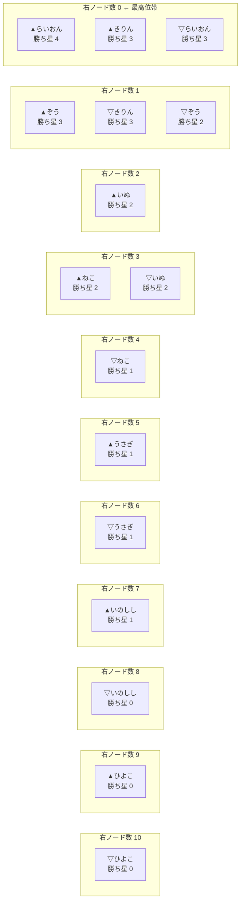
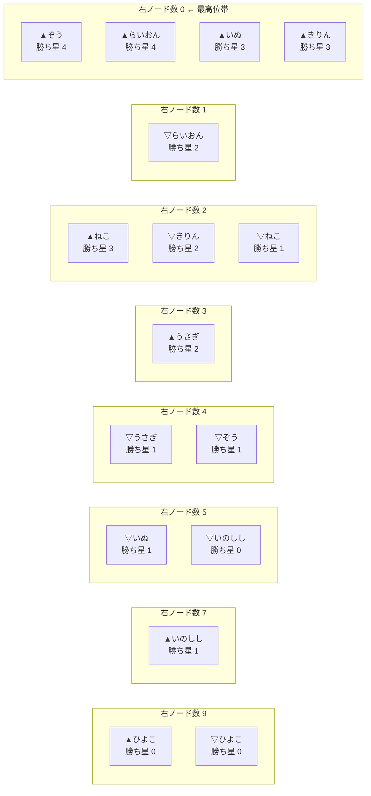
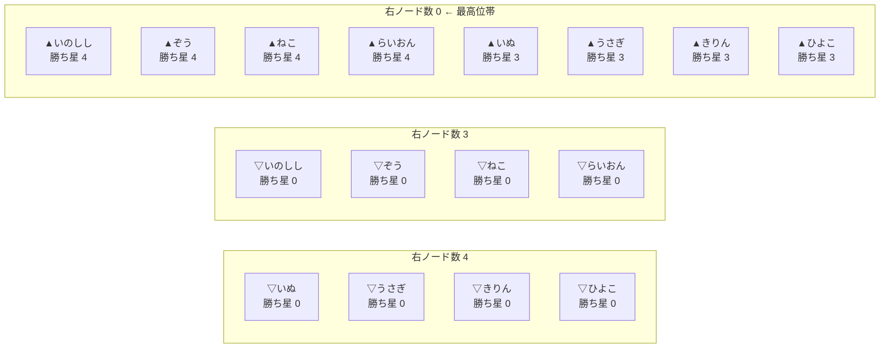

# 【大会ルール案】格付けグラフ戦_4_右ノード順位案

`【大会ルール案】格付けグラフ戦_4.md` と `【大会ルール案】格付けグラフ戦_4_先手勝率スイープ.md` の図をもとに、  
**「右にあるノードが少ないほど高順位」** という見方を、試しに図へしてみる。

## 仮の読み方

この文書では、各ノード `N` について次を数える。

- `右ノード数` = `N` から矢印をたどって、右側へ到達できるノードの個数
- `勝ち星` = そのノードへ入ってくる矢印の本数

そして順位帯を、次の順で決める。

1. **右ノード数が少ないほど高順位**
2. 同じ右ノード数なら、**上から勝ち星が多い順**
3. 同じ右ノード数・同じ勝ち星なら、ここでは同順位帯のまま並べる

つまり、**右端に近いほど偉い**、ただし同じ列の中では**勝ち星が多いものを上へ置く**という案である。

## 注意

この順位案は、まだ **プレイヤー順位ではなくノード順位** である。  
したがって、

- `▲らいおん`
- `▽らいおん`

は別ノードとして別々に現れる。  
最終的にプレイヤー順位へ戻すには、あとで

- `▲/▽` をまとめるか
- 片側だけ採用するか
- 平均や上位側を採るか

など、もう一段ルールが必要である。

## 先手勝率スイープの結論だけ先に

| 先手勝率 | 順位図の変化 | 最上位帯（右ノード数 0） |
|---|---|---|
| 50% | 基準ケース | `▲らいおん`, `▲きりん`, `▽らいおん` |
| 60% | 変化なし | 50% と同じ |
| 70% | 変化なし | 50% と同じ |
| 80% | 変化なし | 50% と同じ |
| 90% | 中位の先手食い込みで変化 | `▲ぞう`, `▲らいおん`, `▲いぬ`, `▲きりん` |
| 100% | ▲側が最上位帯を独占 | すべての `▲` ノード |

この 8 人表では、**50〜80% は同じ順位図** になり、  
最初に見た目が変わるのは 90% からである。

## 50% ケース

50% は `【大会ルール案】格付けグラフ戦_4.md` と同じ。  
右端ほど高順位になるよう、列を **左から右へ 10, 9, ..., 0** の順で並べる。  
つまり、**右端の列が最高位帯** である。

この見方だと、50% ケースでは

- 右端に `▲らいおん`, `▲きりん`, `▽らいおん`
- その 1 列左に `▲ぞう`, `▽きりん`, `▽ぞう`

が来る。  
つまり、**らいおん・きりん付近のノードが最終的な行き止まり**になっている。

## 60% / 70% / 80% ケース

この 8 人表では、60 / 70 / 80% は勝敗図が 50% と変わらない。  
したがって、**右ノード順位図も 50% ケースと同じ**である。

- 60%: 50% と同じ
- 70%: 50% と同じ
- 80%: 50% と同じ

この点は逆に面白くて、**グラフの勝敗構造が変わらない限り、順位図も動かない**。  
この方式は、先手勝率の数値そのものより、**勝敗パターンの変化点**に強く反応する。

## 90% ケース

90% では中位帯の 4 対局が反転し、順位図も変わる。  
このときの列配置は次のようになる。

50% ケースと比べると、

- `▲ぞう`
- `▲いぬ`

が最上位帯へ食い込んでくる。  
つまり、**先手補正が強くなると、右端の最高位帯が厚くなる**。

これは、

- 後手の格上が最後まで耐えていた構図が崩れ
- 先手を引いた中位ノードが、右端まで届く

ということを意味している。

## 100% ケース

100% ではすべての対局が `▽ → ▲` になり、▲ 側ノードが一気に右端へ寄る。  
図は次のようにかなり単純になる。

100% では、**右ノード数 0 の列にすべての ▲ ノードが並ぶ**。  
つまり、この順位案は 100% ケースでは

- 実力比較図というより
- ほぼ先手配置の勝ち残り表

になる。  
このときは「右ノード数が少ないほど高順位」という考え方そのものは残っているが、  
図の意味はかなり変質する。

## この順位案の面白いところ

- グラフそのものを、そのまま**帯状の順位図**へ読み替えられる
- 「右へ抜けたノードほど上位」という直感がある
- 同じ列の中は勝ち星順に並べるので、図として見やすい
- 50〜80% が同形、90% で変化、100% で崩壊、という変化点がよく分かる

## この順位案の難しいところ

- `▲らいおん` と `▽らいおん` をどうプレイヤー順位へ戻すかが未解決
- `右ノード数` を「直接右」ではなく「到達可能な右全体」で数えるので、説明が少し要る
- 同順位帯で勝ち星も同じなら、さらにタイブレークが必要
- 循環や相互食い込みが濃くなると、右ノード数だけでは整理しきれない可能性がある

## 仮まとめ

試してみる価値はかなりある。  
特に、**図を順位表のように読む入口** としては面白い。  

今回の 8 人モデルで見ると、

- 50〜80%: 右端は少数の強ノードに絞られる
- 90%: 中位の先手ノードが右端へ食い込む
- 100%: ▲ 側が一斉に右端へ並ぶ

となった。  
したがって、この順位案は

- **中程度の先手補正までは、かなり見やすい**
- **極端な先手有利では、先手配置を映す図に寄っていく**

という性質がありそうである。  
別案としては、次に

- `▲/▽` をプレイヤーごとに 1 つへまとめた順位図
- 右ノード数ではなく「最長経路長」で読む順位図
- 縮約グラフで帯を作る順位図

も試せそうである。
