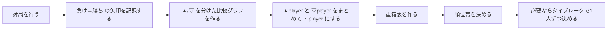
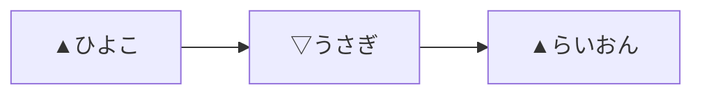
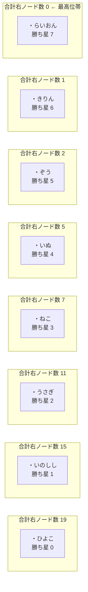

# 【大会ルール発表案】重箱表つき格付けグラフ戦

新しい大会ルール案として、**重箱表つき格付けグラフ戦** を提案する。  
この大会では、参加者は事前の元Eloを持たなくてもよい。  
大会中に生まれた勝敗だけを材料にして、比較グラフと **重箱表** を作り、順位を決める。  

## この大会でやりたいこと

普通の勝ち点表だけだと、

- 誰に勝ったか
- どの帯へ食い込んだか
- 先手 / 後手の違い

が見えにくい。  
そこでこの大会では、勝敗を **グラフ** にし、そのあと **重箱表** にたたんで読む。  

狙いは次の 3 つである。

1. 対局結果をそのまま図として見せる
2. 参加者どうしの比較の道を残す
3. 元Eloなしでも順位表らしい形へ落とし込む

## ルールの全体像

## 記号

- `▲名前` = 先手側のそのプレイヤー
- `▽名前` = 後手側のそのプレイヤー
- `A → B` = `A` が負けて `B` が勝った
- `・名前` = `▲名前` と `▽名前` をまとめたプレイヤー単位の箱

この大会では、まず `▲` と `▽` を分けて細かく見る。  
そのあと、集計段階で `・名前` にまとめる。  

## 勝敗の記録方法

各対局が終わったら、**負けた側から勝った側へ矢印** を 1 本引く。  

例えば次の 2 対局があったとする。

- `▲ひよこ` が `▽うさぎ` に勝った
- `▽うさぎ` が `▲らいおん` に負けた

すると図は、次のようにつながって読める。

この 1 本の道だけでも、

- `▲ひよこ` より `▽うさぎ` が上
- `▽うさぎ` より `▲らいおん` が上

という比較の階段が見える。  
この **比較の道** を大会中に育てていくのが、この大会の面白さである。  

## 比較グラフの考え方

同じプレイヤーでも、

- `▲らいおん`
- `▽らいおん`

は別ノードとして扱う。  
これは、先手と後手の役割が違うからである。  

ただし、観客向けに見るときは、同じ `▲/▽` ならラウンドをまたいで同じノードとしてつなげてよい。  
そのため、複数ラウンドにまたがる比較の道が自然に見える。  

## 重箱表とは何か

比較グラフだけだと細かすぎるので、最後に `▲/▽` をたたんで **重箱表** を作る。  

例えば、

- `▲らいおん`
- `▽らいおん`

をまとめて、

- `・らいおん`

にする。  

このとき、プレイヤーごとに次を集計する。

- 合計右ノード数
- 合計勝ち星
- 合計最長経路長

## 重箱表の順位の読み方

基本の順位は、次の順で読む。

1. **合計右ノード数が少ないほど上位**
2. 同じなら **合計勝ち星が多いほど上位**
3. それでも同じなら **合計最長経路長が短いほど上位**

### 用語の意味

- **合計右ノード数**
  - `▲/▽` の各ノードから右側へ到達できるノード数を足したもの
  - 右端に近いほど少なくなる
- **合計勝ち星**
  - そのプレイヤーの `▲/▽` ノードへ入ってくる矢印本数の合計
- **合計最長経路長**
  - そのプレイヤーの `▲/▽` ノードから右へたどれる最長の道の長さの合計

直感的には、

- 右へ抜けきっている人ほど強い
- 同じ帯なら、勝ち星が多い人を上に置く
- さらに同じなら、深く落ちにくい人を上に置く

というルールである。  

## 8人サンプル

説明用に、次の 8 人モデルを使う。

- らいおん
- きりん
- ぞう
- いぬ
- ねこ
- うさぎ
- いのしし
- ひよこ

ここでは **強い方が勝つ** 仮想例を使う。  
これは説明用の例であり、実際の大会では事前の元Eloを使って順位は決めない。  

## サンプルの重箱表（先手勝率50%ケース）

50% ケースでは、重箱表は次のようなきれいな並びになる。

| 順位 | プレイヤー | 合計右ノード数 | 合計勝ち星 |
|---:|---|---:|---:|
| 1 | `・らいおん` | 0 | 7 |
| 2 | `・きりん` | 1 | 6 |
| 3 | `・ぞう` | 2 | 5 |
| 4 | `・いぬ` | 5 | 4 |
| 5 | `・ねこ` | 7 | 3 |
| 6 | `・うさぎ` | 11 | 2 |
| 7 | `・いのしし` | 15 | 1 |
| 8 | `・ひよこ` | 19 | 0 |

この例では、重箱表にするとかなり素直に強い順へ近い並びになる。  
つまり、ノード図の細かい情報を少し潰す代わりに、**順位表としての読みやすさ** が大きく上がる。  

## 先手有利が極端に強いとき

先手勝率が 100% に近づくと、比較グラフは次第に

- 実力比較グラフ

というより

- 先手配置グラフ

に近づく。  
そのため、重箱表でも大きな同順位帯ができやすい。  

これは欠点でもあるが、見方を変えると、

- 誰でも先手なら勝つ世界では
- 比較がつぶれて横並びになる

という当然の現象を、図が正直に表しているとも言える。  

## ほぼ100%で1位を1人選ぶには

それでも大会運営上、`99.99999…%` のような極限で 1 位を 1 人だけ選びたいことがある。  
そのために、最後のタイブレークとして **`▽被勝者強度`** を使う。  

### `▽被勝者強度` とは

各プレイヤー `・P` について、

1. `▽P` を倒した相手を集める
2. その相手たちが、重箱表でどの順位帯にいるかを見る
3. 強い帯の相手に負けている人を上に置く

という考え方である。  

要するに、

- 弱い相手にしか負けていない人より
- 強い相手にだけ負けている人の方を上にする

というルールである。  

## 最終的な順位決定手順

大会で本当に順位を出すときは、次の順で決める。

1. **重箱表の合計右ノード数**
2. **重箱表の合計勝ち星**
3. **合計最長経路長**
4. **`▽被勝者強度`**
5. **直接対戦の勝者**
6. **追加決定戦** または **同順位**

この順なら、

- まずはグラフ全体の形を使う
- それでも割れないときだけ細かい比較へ進む

という自然な流れになる。  

## この大会の面白さ

### 1. 観客に見せやすい

勝敗がそのまま図になって残るので、

- 誰がどこへ食い込んだか
- どこに比較の道ができたか

を説明しやすい。  

### 2. 元Eloなしでも大会を回せる

参加者は元Eloを持たずに参加してよい。  
順位は大会中にできたグラフから決める。  

### 3. 勝ち点表と違う物語が見える

単に 1 勝 1 敗を見るだけでなく、

- 誰に負けたか
- その負けがどの帯へつながっているか

が見える。  

## 運営上のポイント

- 途中経過では **比較グラフ** を見せる
- 最終結果では **重箱表** を見せる
- さらに必要なら **タイブレーク手順** を公開する

この 3 層に分けると、

- 見た目は面白い
- ルールは説明できる
- 順位も最終的に決められる

という形にしやすい。  

## まとめ

**重箱表つき格付けグラフ戦** は、

- 対局結果をグラフで見せ
- プレイヤー単位へ重箱表でたたみ
- 必要なら極限タイブレークで 1 人ずつ決める

という大会方式である。  

この方式は、

- グラフの面白さ
- 順位表の分かりやすさ
- 元Eloなしでの大会運営

を同時に狙える。  

新しいルールの大会として発表するなら、  
**「勝敗表ではなく、比較グラフと重箱表で順位を作る大会」** という言い方が、一番伝わりやすいと思う。  
