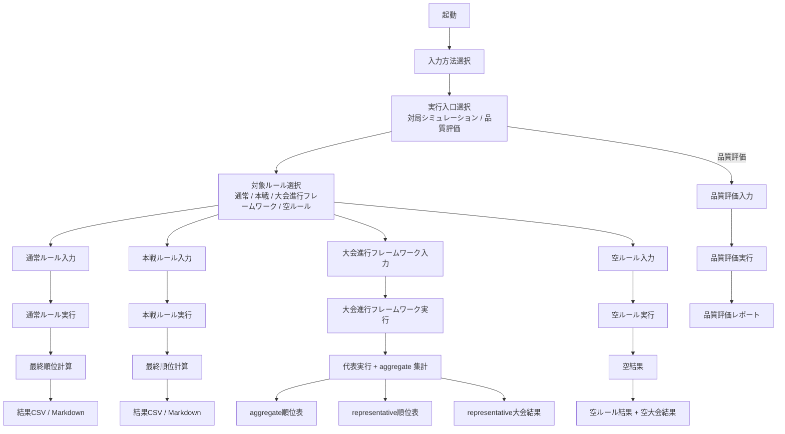
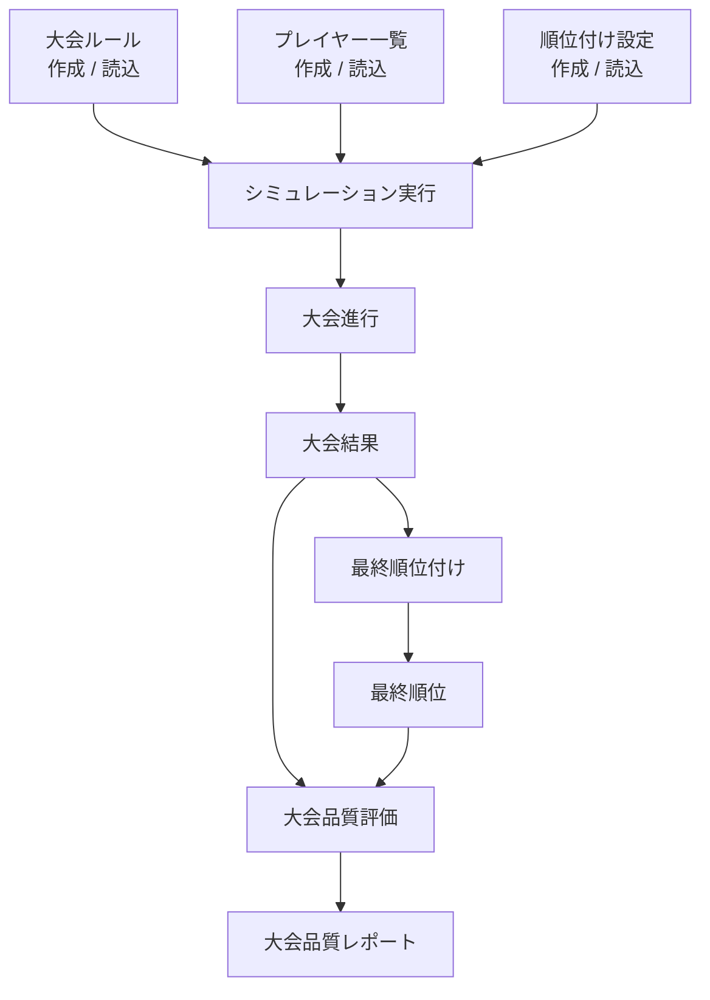

# ［大会ルール作成］の理想形と現状の差

今日はここまでにするとき用に、現状整理を短く残しておくぜ（＾▽＾）

## いまの理解

最終的にやりたいのは、次の流れだ。

- ［大会ルール］を作成、またはファイルから読込
- ［プレイヤー一覧］を作成、またはファイルから読込
- ［順位付け設定］を作成、またはファイルから読込
- ［シミュレーション］開始
- ［大会結果］出力
- ［最終順位付け］開始
- ［最終順位］出力
- ［大会品質評価］開始
- ［大会品質レポート］出力

ただし、今の実装はまだそこまで完全分離されていない。
モードごとに、入力・実行・順位・出力が縦にまとまっている。

## 今の実装に近い図

## 理想形の図

## 今、くっついているところ

### 1. 入力とモードがくっついている

今は、

- 通常ルール
- 本戦ルール
- 大会進行フレームワーク
- 空ルール

ごとに入力手順が強く分かれている。

つまり、

- ［大会ルール］
- ［プレイヤー一覧］
- ［順位付け設定］

を独立した部品として組み立てるというより、モード別の入力画面としてまとまっている。

### 2. 大会進行と順位付けがくっついている

特に大会進行フレームワークでは、実行処理の中で

- 大会進行
- representative の順位付け
- aggregate の順位付け

をまとめて扱っている。

将来的には、

- 大会結果を作る処理
- 順位付けする処理

をもっと分けたい。

### 3. representative と aggregate がくっついている

今は同じ実行の流れの中で、

- representative 順位表
- aggregate 順位表
- representative 大会結果

をまとめて出している。

これは見やすくはなってきたが、概念としてはまだ分離途中だ。

### 4. 品質評価はまだ別系統

品質評価は、

- シミュレーション結果を利用する

という意味ではつながっているが、実装としてはまだ別の入口・別の実行系としてまとまっている。

将来的には、

- 大会結果
- 最終順位
- 品質評価

が自然につながる形へ整理したい。

## 一言でまとめると

今は、

- モードごとに縦にまとまった実装

で、
最終的には、

- 大会ルール
- プレイヤー一覧
- 順位付け設定
- 大会進行
- 大会結果
- 最終順位
- 品質評価

を横に分離したい、という段階だ。

## 次に見たい観点

次に整理するとよさそうなのは、次のどれかだ。

- ファイル対応つきの Mermaid 図
- 入力部品 / 実行部品 / 出力部品の分離図
- representative と aggregate の責務分離図

おやすみだぜ（＾▽＾）
