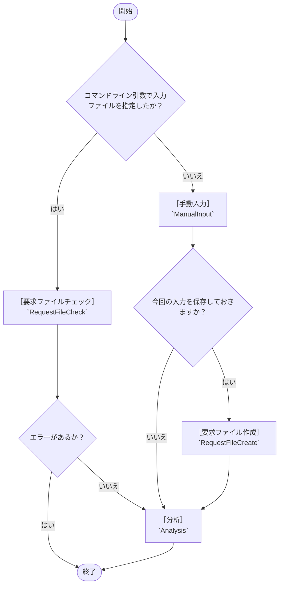
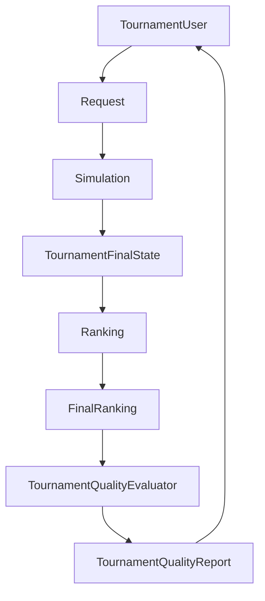

# ライフサイクル

ShogiTournamentSystemAnalyzer の利用時に、入力・検査・分析がどの順で進むかを整理した文書です。

## 目的

- まず入力方法を決める
- 入力ファイルを使う場合は、実行前に不備を検出する
- 手動入力の場合は、必要に応じて要求ファイルとして保存できる
- 最後は分析フローへ集約する

## 全体の流れ

## 3大モード

### `RequestFileCheck`

入力ファイルを検査するモードです。

- STSA ファイルを読み込む
- フォーマット不備を確認する
- 必須セクションや必須キーの不足を確認する
- 実行はしない
- エラーがあればその時点で終了する

### `ManualInput`

対話で入力するモードです。

- 画面の質問に答えながら必要な情報を入力する
- 入力内容をそのまま分析へ渡せる
- 必要なら保存して `RequestFileCreate` 相当の処理へ進める

### `Analysis`

実際に分析を行うモードです。

- 既存のシミュレーションや品質評価の主線に進む
- 入力ファイル経由でも手動入力経由でも、最後はここに集約する
- 出力は既存の `Simulation` / `Ranking` / `TournamentQualityEvaluator` の流れに乗る

## `RequestFileCreate` の位置づけ

`RequestFileCreate` は、`ManualInput` で入力した内容を保存するための補助的な処理です。

- 単独で分析を始めるためのモードではない
- `ManualInput` の途中で呼ばれる保存処理として扱う
- 必要な場合だけ使う

## 4大域

誰が仕事をするか、という見方です。

- `TournamentUser`
  - 大会利用者域
  - 入力ファイルを作る人、読む人、品質レポートを見る人を含む
- `Simulation`
  - 大会ルールとプレイヤー一覧をもとに大会をシミュレーションする
- `Ranking`
  - 大会最終状態をもとに順位付けする
- `TournamentQualityEvaluator`
  - 最終順位をもとに大会の品質を評価する

## 4大境界

何を受け渡すか、という見方です。

- `Request`
  - 依頼という境界
  - 入力ファイルや手動入力の内容をまとめる
  - 以下のサブ境界を持つ
	- `Request/TournamentRule`
	- `Request/PlayerList`
	- `Request/RankingSettings`
- `TournamentFinalState`
  - シミュレーション結果の大会最終状態
- `FinalRanking`
  - 大会最終状態から解釈した最終順位
- `TournamentQualityReport`
  - 最終順位を品質評価した結果

## `Request` 配下のサブ境界

### `Request/TournamentRule`

- 大会ルールに関する依頼情報
- 大会で何が起きたかを表す前提情報

### `Request/PlayerList`

- プレイヤー一覧に関する依頼情報
- 大会利用者域とシミュレーション域の間で使う

### `Request/RankingSettings`

- 順位付けの設定に関する依頼情報
- シミュレーション域や順位付け域が参照する

## アプリケーション・フロー

### 1. 入力・依頼の準備

- `RequestFileCheck`
- `ManualInput`
- `RequestFileCreate`

### 2. 分析

- `Simulation`
- `Ranking`
- `TournamentQualityEvaluator`

### 3. 出力

- `TournamentFinalState`
- `FinalRanking`
- `TournamentQualityReport`

## フローの見え方

## 範囲外

- `TournamentFramework` は独立した第5の大域ではなく、シミュレーション域の大会進行方式として扱う
- `TournamentFramework` 用の入力CSVやDSLは、`Request/TournamentRule`、`Request/PlayerList`、`Request/RankingSettings` に分解できる境界情報として整理する余地がある

## 備考

- 入力ファイルを使う場合は、実行前に `RequestFileCheck` で不備を見つけやすくする
- 手動入力は、保存処理を通じて次回再利用しやすくする
- 最終的には、入力・検査・分析の責務を分離して扱う
